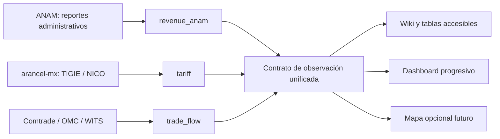

# Arquitectura modular de datos

La plataforma debe organizarse como un **sistema de conocimiento con contratos de datos**, no como una colección de dashboards. La interfaz útil surge cuando cada cifra conserva su fuente, periodo, unidad, metodología y ámbito; la visualización sólo debe consumir observaciones que ya pasaron por esos controles.

> **Decisión actual.** La modularidad se implementa primero mediante contratos, repositorios con responsabilidad definida y rutas de producto. No se crean subdominios ni microservicios sólo por separar pantallas. Un dominio nuevo se justifica cuando exige ciclo de despliegue, permisos, rendimiento, almacenamiento o soporte distintos.

## Modelo unificado

El contrato `data/contracts/unified-trade-data-model.yaml` y el esquema `schemas/unified-trade-observation.schema.json` definen una observación con tres dominios mutuamente excluyentes.

| Dominio | Pregunta que responde | Dimensiones que exige | No debe confundirse con |
|---|---|---|---|
| `revenue_anam` | ¿Qué recaudación u operación administrativa reportó ANAM? | Autoridad, concepto fiscal, periodo, aduana/ámbito cuando se publique, momento contable, unidad y moneda. | Valor de comercio, tasa arancelaria o estadística de socio comercial. |
| `tariff` | ¿Qué tasa o compromiso corresponde a una línea y contexto de preferencia? | Importador, socio/preferencia, HS/TIGIE/NICO, versión de clasificación, tipo de tasa, base de valoración y periodo. | Importe efectivamente recaudado. |
| `trade_flow` | ¿Qué flujo de mercancías reportó una fuente estadística? | Reportante, socio, flujo, producto, edición HS, periodo, valoración, moneda y cantidad cuando se publique. | Recaudación administrativa o obligación jurídica individual. |

La clave lógica incorpora dominio, fuente/dataset, release o vintage, periodo, geografía, clasificación y medida. Así se evita que dos valores con el mismo producto o país queden erróneamente unidos sólo porque parecen relacionados.

## Responsabilidades modulares

| Módulo | Responsabilidad | Repositorio o capa actual | Forma de integración recomendada |
|---|---|---|---|
| Registro de fuentes | Identidad, autoridad, URL, hash, licencia, consulta y estado editorial. | `wiki-comercio-exterior-mx` | `sources/registry.yaml`, manifiestos y esquemas existentes. |
| Contrato de observación | Valida dominio, periodo, unidad, fuente, geografía, producto y exclusiones. | `wiki-comercio-exterior-mx` | Nuevo esquema unificado; validación local y en CI. |
| Dominio arancelario | LIGIE, TIGIE, fracción, NICO, reglas de cálculo y releases oficiales. | `arancel-mx` | Adaptador de solo lectura con dataset, versión, hash y URL; no duplicar tablas. |
| Vigilancia normativa | Detecta cambios de documentos, conserva evidencia y diferencia versiones. | `dof-diff-lab` | Eventos con URL, hash, evidencia y revisión humana; nunca declarar vigencia automáticamente. |
| Geografía | Produce geometría mundial y relaciones geoespaciales canónicas. | `aduanamap-mx` | Consumir sólo artefacto público, inmutable y verificable; mientras tanto, enlaces y tablas. |
| Dashboard | Filtra y explica observaciones ya publicadas. | Wiki estática | JSON local versionado, HTML primero, JavaScript opcional y controles nativos. |

Esta separación reutiliza la fortaleza de cada repositorio. `arancel-mx` es el dueño del detalle arancelario mexicano; `dof-diff-lab` vigila cambios documentales; `aduanamap-mx` mantiene geometría; la wiki conserva el contexto, las relaciones, la evidencia y las vistas de lectura. Fusionarlos convertiría ciclos de cambio muy distintos en una sola superficie frágil.

## Priorización micro / meso / macro

| Horizonte | Prioridad | Resultado verificable | Qué se pospone |
|---|---|---|---|
| **Micro** | Calidad de observación y de fuente. | Cada dato lleva dominio, fuente, periodo, unidad, moneda, release/vintage y nota metodológica; los filtros no fabrican combinaciones vacías. | APIs en vivo, mapas y agregaciones globales. |
| **Meso** | Relaciones entre instrumento, producto, país, socio, operación y fuente. | Adaptadores con identificadores y hashes; catálogo de indicadores; enlaces entre páginas jurídicas, arancelarias y estadísticas. | Fusión automática de cambios normativos o cálculos individuales. |
| **Macro** | Exploración México–mundo y producto modular. | Series comparables con tabla equivalente, descarga versionada y mapa opcional sobre la misma lista. | Globo 3D, proveedor de teselas o subdominios sin necesidad operacional. |

## Estrategia de dominios y herramientas

La referencia de `sdv.com.mx` muestra el valor de separar contenido, herramientas y novedades, pero esa separación debe aplicarse a la **responsabilidad del producto**, no copiando visuales ni multiplicando infraestructura.[^sdv]

| Etapa | Ruta o herramienta | Cuándo basta | Cuándo merece subdominio o aplicación separada |
|---|---|---|---|
| Conocimiento | `wiki-comercio-exterior-mx` | Documentación, catálogo, fuentes, dashboards estáticos y filtros locales. | Sólo si la publicación editorial requiere una plataforma distinta. |
| Aranceles | `arancel-mx` | Consulta de LIGIE/NICO, releases, API o CLI del dominio arancelario. | Ya es un dominio propio; conservar su independencia. |
| Alertas | `dof-diff-lab` | Detección y revisión de cambios en lote. | Si se requiere suscripción, perfiles de usuario, SLA o notificaciones personalizadas. |
| Mapa | `aduanamap-mx` | Geometría canónica, relaciones y exploración geográfica. | Cuando haya una experiencia pública estable con datos y atribución propios. |
| Herramientas | Ruta `herramientas/` dentro de la wiki al principio. | Calculadoras o filtros que consumen contratos locales y no guardan datos. | Si aparece autenticación, expedientes, pagos, cargas grandes, tareas de larga duración o soporte independiente. |
| Datos | Archivos versionados y contratos en el repositorio al principio. | Conjuntos pequeños, corte definido y uso de lectura. | Si hay APIs estables, snapshots grandes, permisos o actualizaciones programadas. |

La primera opción adecuada es una **familia de repositorios y contratos compartidos**, con navegación coherente entre herramientas. Un prefijo o subdominio sólo debe llegar después de demostrar que una capacidad necesita operar, desplegarse o mantenerse de forma independiente.

## Prototipo ANAM

El prototipo existente de [Recaudación ANAM](../wiki/aduana/recaudacion-anam.md) implementa el patrón inicial correcto: datos locales versionados del corte Q2 2026, filtros nativos, tabla de respaldo, fuente primaria visible y estados vacíos cuando ANAM no publica la granularidad solicitada. La página no es una API de ANAM ni afirma una serie completa; es una vista verificable de campos publicados.[^anam]

Su siguiente mejora debe consumir observaciones `revenue_anam` validadas contra el nuevo esquema. Sólo después de extraer cada PDF con periodo, unidad, metodología y fuente se deberá ampliar de Q2 2026 a una serie multianual.

## Criterios antes de incorporar datos internacionales

Un indicador mundial sólo entra a un dashboard si declara al menos fuente, dataset, release/vintage, fecha de consulta, reportante, socio si corresponde, flujo, clasificación y versión, producto/nivel, periodo/frecuencia, valor/unidad/moneda, base de valoración y método. La OMC distingue aranceles consolidados, aplicados y preferenciales; UN Comtrade y WITS agregan fuentes, coberturas y revisiones diferentes. Por eso un valor internacional no se convierte automáticamente en recaudación ANAM ni en obligación arancelaria mexicana.[^wto] [^comtrade]

## Fuentes

- Contrato `data/contracts/unified-trade-data-model.yaml`.
- Esquema `schemas/unified-trade-observation.schema.json`.
- [Recaudación ANAM](../wiki/aduana/recaudacion-anam.md).
- [Mundo y fuentes comparables](../explore/mundo.md).
- [Contratos entre repositorios](../methodology/cross-repo-contracts.md).

[^anam]: [ANAM, Recaudación](https://www.anam.gob.mx/recaudacion-anam/), consultado el 20 de agosto de 2026. El prototipo utiliza solamente las cifras explícitas del informe Q2 2026 y conserva su URL.
[^wto]: [WTO Tariff & Trade Data](https://ttd.wto.org/en) y [WTO, información sobre aranceles](https://www.wto.org/english/tratop_e/tariffs_e/tariff_data_e.htm), consultadas el 20 de agosto de 2026.
[^comtrade]: [UN Comtrade](https://comtrade.un.org/), [WITS](https://wits.worldbank.org/) y [SDMX](https://ec.europa.eu/eurostat/web/sdmx-infospace/sdmx-explained), consultados el 20 de agosto de 2026.
[^sdv]: [sdv.com.mx](https://sdv.com.mx/), [Herramientas](https://sdv.com.mx/herramientas/) y [Noticias](https://sdv.com.mx/noticias/), observados el 20 de agosto de 2026 como referencia pública de arquitectura de información, no como especificación técnica ni afirmación independiente de sus métricas.
