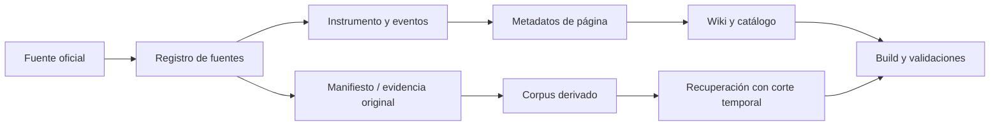

# Cómo funciona la wiki

Wiki Comercio Exterior MX es un sistema documental **con México al centro**. Su propósito es ayudar a estudiar y recorrer el comercio exterior conectando una explicación legible con la fuente oficial, la fecha de vigencia y el estado de revisión que corresponden. La wiki no es una autoridad, no sustituye al Diario Oficial, SAT, ANAM, Secretaría de Economía ni una asesoría profesional para un caso particular.

> **Misión operativa.** Convertir un conjunto disperso de normas, trámites, directorios y publicaciones oficiales en rutas de consulta comprensibles, verificables y temporalmente explícitas.
>
> **Visión de calidad.** Que una persona pueda pasar de una pregunta práctica —por ejemplo, clasificar una mercancía, identificar una regulación, preparar un despacho o ubicar el trámite aplicable— a la fuente oficial y a su contexto, sin confundir una síntesis editorial, un portal operativo y una disposición jurídica.

## Qué problema resuelve

El comercio exterior mexicano cruza varias capas: clasificación arancelaria, regulaciones y restricciones no arancelarias, contribuciones, despacho, programas de fomento, logística, tratados y autoridades con competencias distintas. Un mismo caso puede requerir una página de ANAM, una ficha de trámite, una regla general, un anexo y un texto legal consolidado. La wiki organiza esas relaciones para que la consulta no dependa de una búsqueda aislada o de una respuesta sin fecha.

| Necesidad de consulta | Capa principal en la wiki | Resultado esperado |
|---|---|---|
| Comprender un concepto | `docs/wiki/` | Explicación pedagógica, límites y enlaces relacionados. |
| Encontrar la fuente que respalda un tema | `sources/` y `docs/catalog/` | URL oficial, autoridad, tipo de evidencia y relaciones con instrumentos. |
| Seguir una operación | Portada, rutas de wiki y páginas de aduana | Secuencia orientativa desde clasificación hasta despacho y logística. |
| Revisar un anexo, un formato o un trámite | Catálogo, páginas RGCE y fuente SIDOF | Asiento oficial, publicación y distinción entre resumen y documento vinculante. |
| Consultar contenido local con fecha de corte | Corpus y evaluación de recuperación | Resultados filtrados por vigencia, revisión y elegibilidad, con citas. |

## Arquitectura por capas

La arquitectura evita que una sola página haga todos los trabajos. El registro de fuentes conserva la identidad de una URL oficial; el grafo de instrumentos modela publicaciones, vigencia y modificaciones; los manifiestos preservan evidencia sin relicenciar los documentos; el corpus prepara resúmenes de recuperación, y la wiki ofrece explicaciones para personas lectoras. Estas capas se conectan mediante identificadores estables, no mediante enlaces informales únicamente.

| Capa | Ubicación canónica | Función | No debe confundirse con… |
|---|---|---|---|
| Registro de fuentes | `sources/registry.yaml` | Define fuentes oficiales, autoridad, tipo de evidencia, hosts permitidos y reglas de sondeo. | La vigencia jurídica de una disposición. |
| Grafo de instrumentos | `sources/instruments.yaml` | Relaciona publicación, efectividad, anexos, modificaciones y consolidaciones. | Un directorio o portal operativo mutable. |
| Metadatos de página | `sources/page_metadata.yaml` | Vincula cada página o digest con fuentes, instrumentos, estado de extracción, revisión y corte temporal. | Una aprobación automática de contenido jurídico. |
| Evidencia original | `data/originals/` y Releases | Conserva manifiestos, URLs y hashes; los bytes oficiales se preservan conforme a su política. | Contenido relicenciado por el proyecto. |
| Corpus derivado | `data/corpus/` | Aporta digests orientados a recuperación. | El texto vinculante de una ley, regla o anexo. |
| Wiki y catálogo | `docs/` | Explica, conecta y hace navegables las fuentes. | Una resolución individual o una fuente primaria. |
| Evaluación y validación | `evals/`, `tests/` y `scripts/` | Comprueba contratos, cobertura, temporalidad, sitio y comportamiento de recuperación. | Una validación jurídica de todas las operaciones posibles. |

## Flujo de evidencia y publicación

El flujo empieza con una fuente oficial. Una publicación de SIDOF puede incorporarse al registro y relacionarse con su instrumento; un portal de ANAM puede registrarse como fuente operativa. Después, los metadatos de página declaran qué fuentes e instrumentos respaldan una explicación y con qué estado editorial. Los validadores comprueban esquemas, referencias, fechas, contenido generado y consistencia de la cobertura antes de construir el sitio.

La regla editorial central es que las dimensiones se mantienen separadas. Una URL disponible no demuestra vigencia; un documento extraído no demuestra revisión jurídica; una publicación no autoriza por sí sola una respuesta para una fecha posterior; y un portal institucional no sustituye el fundamento que regula un acto concreto.

## Cómo leer una fuente

La wiki utiliza tres categorías prácticas para evitar equivalencias erróneas. Una **fuente jurídica primaria** respalda la publicación o el texto aplicable; un **portal o directorio operativo** ayuda a iniciar una gestión, localizar una oficina o consultar información administrativa; y una **explicación editorial** conecta conceptos y rutas, pero no crea obligaciones.

| Ejemplo | Papel correcto | Precaución |
|---|---|---|
| Ley Aduanera, DOF/SIDOF y anexos de RGCE | Fuente jurídica primaria. | Verificar publicación, vigencia y modificaciones aplicables. |
| FAQ e Información por Aduanas de ANAM | Orientación y directorio operativo. | Conservar URL y fecha de consulta; no presentar contactos, montos u horarios como norma inmutable. |
| Página de ANAM, pedimento o despacho en esta wiki | Explicación editorial. | Seguir los enlaces de fuentes oficiales y el aviso de alcance. |
| Digest del corpus | Material de recuperación y apoyo. | No usarlo como sustituto del documento vinculante. |

Un ejemplo importante es el horario de una aduana. El directorio de ANAM permite ubicar una aduana y datos de contacto; el horario normativo se debe corroborar contra el Anexo 4 vigente de las RGCE. La [guía de preguntas frecuentes de ANAM](../wiki/aduana/faq-anam.md) aplica este criterio a paquetes, equipaje, donaciones, abandono, declaración de dinero, copias certificadas, consulta de operaciones y denuncias.

## Recorrido de una consulta

La portada propone una secuencia general: clasificar la mercancía, revisar RRNA, determinar contribuciones, preparar el despacho y atender la logística. No todas las personas empiezan ahí. Una persona viajera puede iniciar por equipaje; quien recibe un paquete, por el seguimiento o la retención; y una empresa, por clasificación, padrón, regulación y documentos. La finalidad de los enlaces por situación es orientar el primer paso sin afirmar que todos los casos comparten el mismo procedimiento.

Cuando la consulta se refiere a una regla o anexo, la ruta correcta es: identificar el tema, abrir la explicación de la wiki, verificar el catálogo o el asiento oficial, revisar la fecha de corte y comprobar la autoridad competente. Cuando se refiere a un trámite o problema operativo, la ruta parte del portal oficial correspondiente, pero conserva el mismo deber de corroborar el fundamento jurídico aplicable.

## Automatización, calidad y límites

El repositorio combina validaciones deterministas y comprobaciones programadas. Las validaciones locales revisan esquemas, referencias, metadatos, generación de catálogos, evaluación temporal de recuperación y construcción estricta del sitio. Las comprobaciones externas se mantienen separadas del flujo determinista y no transforman por sí mismas el estado jurídico de una fuente. Un resultado HTTP correcto, por ejemplo, sólo acredita transporte; no acredita que la disposición esté vigente.

La preservación tiene también un límite deliberado. Los documentos oficiales no se relicencian como contenido propio del proyecto y los PDFs no se copian al árbol de la wiki. En su lugar se conservan referencia, manifiesto, hash y vínculo de origen cuando la política de evidencia lo permite. Por eso, ante tablas, imágenes o formatos complejos, la wiki enlaza la fuente oficial y resume su función en vez de reproducirla.

## Relaciones con otros proyectos

La wiki no almacena la tabla arancelaria estructurada fila por fila. Esa responsabilidad pertenece a [`arancel-mx`](https://github.com/jccontrerasg08-cpu/arancel-mx), proyecto que concentra datos reproducibles de LIGIE/NICO, versiones y herramientas de consulta. Asimismo, los recursos de cartografía y exploración mantienen sus límites de repositorio. Esta separación reduce duplicación y permite que cada capa mantenga su contrato de calidad.

## Ver también

[Alcance del proyecto](scope.md) · [Arquitectura técnica](../ARCHITECTURE.md) · [Metodología](../methodology/index.md) · [Modelo de estados](../methodology/status-model.md) · [Mapa de conocimiento](../explore/knowledge-map.md) · [Preguntas frecuentes ANAM](../wiki/aduana/faq-anam.md)

> No es asesoría legal. Verifica el acto, la fecha de vigencia, la autoridad competente y la fuente oficial antes de actuar.
