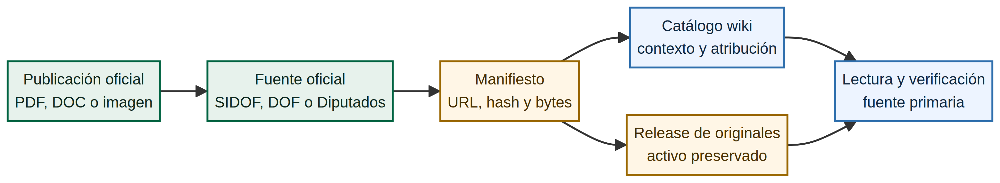

# Publicaciones oficiales preservadas

Esta biblioteca integra las publicaciones oficiales como **evidencia documental de primera clase** dentro de la wiki. Cada registro conserva su fuente primaria, formato, hash SHA-256, activo de preservación y uso editorial. La wiki puede describir, organizar y enlazar esos documentos; **no reclama su autoría ni los relicencia como Apache-2.0**.

> **Lectura responsable.** Los documentos oficiales conservan la autoría y condiciones de su emisor. La redacción, el catálogo, las relaciones documentales y el diagrama de esta página son contenido original de Wiki Comercio Exterior MX; los PDFs, DOCs, imágenes digitalizadas y textos oficiales siguen identificados como `official-not-relicensed`.

## Cómo se preserva una publicación

Las copias de evidencia no se guardan como archivos anónimos ni se mezclan con el Markdown original. El manifiesto conserva el nombre del archivo, URL oficial, hash, tamaño y condición de redistribución. Los bytes preservados se distribuyen como activos de un release del repositorio, mientras el catálogo aporta contexto y conduce a la fuente primaria.

| Elemento | Función | Titularidad o licencia |
|---|---|---|
| Publicación oficial | Documento vinculante, consolidado, trámite o edición digitalizada. | Autoría y condiciones del emisor oficial. |
| Manifiesto | URL, hash SHA-256, tamaño, formato y relación con el resumen. | Metadato del proyecto; no altera los derechos del documento. |
| Release de originales | Paquete de bytes preservados y verificables. | Activo de evidencia; no se relicencia como contenido propio. |
| Catálogo y explicación wiki | Contexto, enlaces, taxonomía y rutas de consulta. | Contenido original de la wiki, Apache-2.0. |
| Diagrama de esta página | Explicación visual de la cadena de evidencia. | Contenido original de la wiki, Apache-2.0. |

## Paquetes de evidencia disponibles

Los paquetes conservan los originales como activos separados para evitar que una copia preservada se confunda con una obra creada por la wiki. Descarga el paquete sólo si necesitas verificar los bytes; para interpretar una regla, usa primero el asiento oficial y el aviso de vigencia correspondiente.

| Paquete | Release de preservación | Contenido principal | Verificación |
|---|---|---|---|
| Cámara de Diputados | [originals-diputados.zip](https://github.com/jccontrerasg08-cpu/wiki-comercio-exterior-mx/releases/download/originals-2026.08.13/originals-diputados.zip) | PDFs de Ley Aduanera, Reglamento, LIGIE, Ley de Comercio Exterior y otros instrumentos. | Hash del paquete: `9ce0958107bab45858a29a57fb41e7007f64cc19594a7762df2d22d20ac7eff4`. |
| SIDOF / DOF | [originals-sidof.zip](https://github.com/jccontrerasg08-cpu/wiki-comercio-exterior-mx/releases/download/originals-2026.08.13/originals-sidof.zip) | Documentos oficiales de RGCE 2026, anexos y modificaciones seleccionadas. | Hash del paquete: `a5da2087ef4ce139e2df8e7e50db115f4e0334e5febf3de002ac44da20d302ae`. |

## Documentos íntegros de acceso directo

El release [Fuentes primarias íntegras 2026.08.19](https://github.com/jccontrerasg08-cpu/wiki-comercio-exterior-mx/releases/tag/primary-sources-2026.08.19) expone cada archivo como descarga individual. Cada activo fue extraído sin conversión de los paquetes de preservación del repositorio y su SHA-256 fue comprobado contra el manifiesto correspondiente. La descarga individual es una copia de evidencia; el enlace de la columna **Emisor oficial** sigue siendo la referencia vinculante.

| Documento íntegro | Descarga de evidencia exacta | Emisor oficial | SHA-256 verificado |
|---|---|---|---|
| Ley Aduanera | [PDF íntegro](https://github.com/jccontrerasg08-cpu/wiki-comercio-exterior-mx/releases/download/primary-sources-2026.08.19/Ley_Aduanera.pdf) | [PDF de Cámara de Diputados](https://www.diputados.gob.mx/LeyesBiblio/pdf/LAdua.pdf) | `43927095d22ff7bc7780e78132d2160b5050b5f76026b539daec32be09d7341d` |
| Reglamento de la Ley Aduanera | [PDF íntegro](https://github.com/jccontrerasg08-cpu/wiki-comercio-exterior-mx/releases/download/primary-sources-2026.08.19/Reglamento_Ley_Aduanera.pdf) | [PDF de Cámara de Diputados](https://www.diputados.gob.mx/LeyesBiblio/regley/Reg_LAdua.pdf) | `bcdfcd9073014aec4aefbacc01c9dd5b1f97f0da0c4556f0f506d20f12d77812` |
| LIGIE 2022 | [PDF íntegro](https://github.com/jccontrerasg08-cpu/wiki-comercio-exterior-mx/releases/download/primary-sources-2026.08.19/LIGIE_2022.pdf) | [PDF de Cámara de Diputados](https://www.diputados.gob.mx/LeyesBiblio/pdf/LIGIE_2022.pdf) | `a7688a47c8283f327b943e06ed948782feba2f5a0e16fe796d50d8340ce40ece` |
| Ley de Comercio Exterior | [PDF íntegro](https://github.com/jccontrerasg08-cpu/wiki-comercio-exterior-mx/releases/download/primary-sources-2026.08.19/Ley_Comercio_Exterior.pdf) | [PDF de Cámara de Diputados](https://www.diputados.gob.mx/LeyesBiblio/pdf/LCE.pdf) | `3f114f47007c21b4691bad502b786b45aa5e45c1571bd56dd8ca4f5af991b459` |
| RGCE 2026 y Anexo 13 | [DOC íntegro](https://github.com/jccontrerasg08-cpu/wiki-comercio-exterior-mx/releases/download/primary-sources-2026.08.19/RGCE_2026_y_Anexo_13.doc) | [Asiento SIDOF](https://sidof.segob.gob.mx/notas/5777199) · [imagen oficial](https://sidof.segob.gob.mx/notas/imagenes/5777199) | `778d0c051ec8af75ccf8b2f3f064b3045a0dc0b5c40fb66dba9e9421dafc3ebf` |
| Anexo 1 de RGCE 2026 | [DOC íntegro](https://github.com/jccontrerasg08-cpu/wiki-comercio-exterior-mx/releases/download/primary-sources-2026.08.19/Anexo_1_RGCE_2026.doc) | [Asiento SIDOF](https://sidof.segob.gob.mx/notas/5777997) | `f098a1b165612b1fec3e0e522510bf0ad19c387d367cf1860d0e89477ad0e742` |
| Anexo 2 de RGCE 2026 | [DOC íntegro](https://github.com/jccontrerasg08-cpu/wiki-comercio-exterior-mx/releases/download/primary-sources-2026.08.19/Anexo_2_RGCE_2026.doc) | [Asiento SIDOF](https://sidof.segob.gob.mx/notas/5778101) | `cce1a6e21bfb3499fd35fac3065b35336cba371de25fc959acdf207218eab2e6` |
| Anexos 3–12 y 14–20 de RGCE 2026 | [DOC íntegro](https://github.com/jccontrerasg08-cpu/wiki-comercio-exterior-mx/releases/download/primary-sources-2026.08.19/Anexos_3_a_12_y_14_a_20_RGCE_2026.doc) | [Asiento SIDOF](https://sidof.segob.gob.mx/notas/5778241) | `9ac1efa0a6608e7813a3cad36748f3c861c99cd283c3bb219f8d4c14a6fce382` |

## Lote ampliado: reformas, contribuciones y operación digital

El release [Fuentes primarias íntegras 2026.08.19 — lote ampliado](https://github.com/jccontrerasg08-cpu/wiki-comercio-exterior-mx/releases/tag/primary-sources-2026.08.19-extended) incorpora nueve documentos adicionales. Todos se conservan en su formato nativo, se enlazan con su emisor oficial y cuentan con hash SHA-256. Las reformas y modificaciones se muestran como actos separados: no sustituyen por sí solas la versión consolidada del instrumento que modifican.

| Documento íntegro | Descarga de evidencia exacta | Emisor oficial | SHA-256 verificado |
|---|---|---|---|
| Reforma LIGIE, 29-dic-2025 | [PDF íntegro](https://github.com/jccontrerasg08-cpu/wiki-comercio-exterior-mx/releases/download/primary-sources-2026.08.19-extended/LIGIE_2022_ref02_29dic25.pdf) | [PDF de Cámara de Diputados](https://www.diputados.gob.mx/LeyesBiblio/ref/ligie_2022/LIGIE_2022_ref02_29dic25.pdf) | `3c5285cf2b250af0175ae9f31d69d069915834acdfa7150c3449349f087690bf` |
| Ley del IVA | [PDF íntegro](https://github.com/jccontrerasg08-cpu/wiki-comercio-exterior-mx/releases/download/primary-sources-2026.08.19-extended/LIVA.pdf) | [PDF de Cámara de Diputados](https://www.diputados.gob.mx/LeyesBiblio/pdf/LIVA.pdf) | `f2b5b1770441a6a4e48f3ade408f9ff7a3e9c81bd5d529e52484f49e4a8e91a6` |
| Ley del IEPS | [PDF íntegro](https://github.com/jccontrerasg08-cpu/wiki-comercio-exterior-mx/releases/download/primary-sources-2026.08.19-extended/LIEPS.pdf) | [PDF de Cámara de Diputados](https://www.diputados.gob.mx/LeyesBiblio/pdf/LIEPS.pdf) | `32639ede8448f91e6ddde556d4b8bceaf349b904bc21631f06e1c8a7a3d416f4` |
| Ley Federal de Derechos | [PDF íntegro](https://github.com/jccontrerasg08-cpu/wiki-comercio-exterior-mx/releases/download/primary-sources-2026.08.19-extended/LFD.pdf) | [PDF de Cámara de Diputados](https://www.diputados.gob.mx/LeyesBiblio/pdf/LFD.pdf) | `64b08a1ff8e5c71759acf550cf9c8df7eb343ea679a2c2663d0eef3db19f10df` |
| Decreto TIGIE, 29-dic-2025 | [DOC íntegro](https://github.com/jccontrerasg08-cpu/wiki-comercio-exterior-mx/releases/download/primary-sources-2026.08.19-extended/5777376.doc) | [SIDOF 5777376](https://sidof.segob.gob.mx/notas/5777376) | `47a6b215fdf1574ff80af559eb3f230cb16e680d961f758a3e459df3bf4a5654` |
| Anexos 21–30 de RGCE 2026 | [DOC íntegro](https://github.com/jccontrerasg08-cpu/wiki-comercio-exterior-mx/releases/download/primary-sources-2026.08.19-extended/5778300.doc) | [SIDOF 5778300](https://sidof.segob.gob.mx/notas/5778300) | `524413859c053085d141231a48163b94a057fa7e766581a20b4bfafba6adf9fa` |
| Primera modificación a RGCE 2026 | [DOC íntegro](https://github.com/jccontrerasg08-cpu/wiki-comercio-exterior-mx/releases/download/primary-sources-2026.08.19-extended/5787425.doc) | [SIDOF 5787425](https://sidof.segob.gob.mx/notas/5787425) | `5c57438d458fd86c23fe8e7a099a73367dbc3769f1499dcfa2d9728292333cf6` |
| Anexos 5, 22 y 29 de la primera modificación RGCE 2026 | [DOC íntegro](https://github.com/jccontrerasg08-cpu/wiki-comercio-exterior-mx/releases/download/primary-sources-2026.08.19-extended/5787982.doc) | [SIDOF 5787982](https://sidof.segob.gob.mx/notas/5787982) | `ef1616334dbe2d0ae0820cc77a5d2abfa7afa5403d484edd20f1b0b6264fc5d7` |
| Decreto de Ventanilla Única de Trámites de Comercio Exterior, 2026 | [DOC íntegro](https://github.com/jccontrerasg08-cpu/wiki-comercio-exterior-mx/releases/download/primary-sources-2026.08.19-extended/5786598.doc) | [SIDOF 5786598](https://sidof.segob.gob.mx/notas/5786598) | `4d61917bfc331fbb24088f5e35a03e6622db42f6225db8ae58267d7e107090ca` |

El archivo de Anexos 21–30 conserva la publicación íntegra como fue emitida. La consulta específica de Anexos 22, 24 o 30 debe cotejarse con la publicación y modificaciones posteriores correspondientes; esta biblioteca no divide ni reescribe los bytes oficiales para hacer pasar un extracto como texto autónomo.

## Ciclo dos: reglas de Secretaría de Economía, IMMEX y PROSEC

El release [Fuentes primarias íntegras 2026.08.19 — ciclo dos](https://github.com/jccontrerasg08-cpu/wiki-comercio-exterior-mx/releases/tag/primary-sources-2026.08.19-cycle-two) conserva cuatro actos SIDOF completos como eventos independientes. Su inclusión permite verificar los bytes de cada publicación, pero no convierte una reforma aislada en una versión consolidada ni sustituye el análisis de vigencia del instrumento afectado.

| Publicación íntegra | Descarga de evidencia exacta | Publicación oficial | SHA-256 verificado |
|---|---|---|---|
| Reglas y criterios de carácter general en materia de comercio exterior, 9-may-2022 | [DOC íntegro](https://github.com/jccontrerasg08-cpu/wiki-comercio-exterior-mx/releases/download/primary-sources-2026.08.19-cycle-two/5651333.doc) | [SIDOF 5651333](https://sidof.segob.gob.mx/notas/5651333) | `c1947b6af0c5a7dfb4c86533400fd06d01663cf652b0686ca999f249cbf042e8` |
| Decreto de reforma IMMEX, 19-dic-2024 | [DOC íntegro](https://github.com/jccontrerasg08-cpu/wiki-comercio-exterior-mx/releases/download/primary-sources-2026.08.19-cycle-two/5745788.doc) | [SIDOF 5745788](https://sidof.segob.gob.mx/notas/5745788) | `44a2ccbaa5af83adc2842a19da0dc516463dbe54f793e7e2d662cf3081406ffa` |
| Decreto de reforma IMMEX, 28-ago-2025 | [DOC íntegro](https://github.com/jccontrerasg08-cpu/wiki-comercio-exterior-mx/releases/download/primary-sources-2026.08.19-cycle-two/5766797.doc) | [SIDOF 5766797](https://sidof.segob.gob.mx/notas/5766797) | `0d89a5f79defcd80804ad7c3f646da3b5533f8314d8c1ffd67cbbd76b9b438dd` |
| Decreto de modificación TIGIE y PROSEC, 23-abr-2026 | [DOC íntegro](https://github.com/jccontrerasg08-cpu/wiki-comercio-exterior-mx/releases/download/primary-sources-2026.08.19-cycle-two/5785818.doc) | [SIDOF 5785818](https://sidof.segob.gob.mx/notas/5785818) | `cf8214d2b8621955396851b59e39dee502148520d8fcdcd98e28f2b79e92b550` |

Estas publicaciones se consultan junto con las versiones consolidadas oficiales y las reformas posteriores aplicables. Las copias administrativas de SNICE para IMMEX o PROSEC pueden ser útiles como material de consulta, pero no reemplazan los actos SIDOF que documentan la publicación y el efecto cronológico de las modificaciones.

## Núcleo jurídico de comercio exterior

Los siguientes PDFs están preservados como archivos de evidencia dentro del paquete de Cámara de Diputados. La versión oficial enlazada es la referencia vinculante; la copia de release permite comprobación de integridad frente al manifiesto.

| Publicación | Archivo preservado | Fuente oficial | SHA-256 del archivo | Uso en la wiki |
|---|---|---|---|---|
| Ley Aduanera | `diputados/LAdua.pdf` | [PDF oficial](https://www.diputados.gob.mx/LeyesBiblio/pdf/LAdua.pdf) | `43927095d22ff7bc7780e78132d2160b5050b5f76026b539daec32be09d7341d` | Marco de despacho, regímenes, facultades y actos aduaneros. |
| Reglamento de la Ley Aduanera | `diputados/Reg_LAdua.pdf` | [PDF oficial](https://www.diputados.gob.mx/LeyesBiblio/regley/Reg_LAdua.pdf) | `bcdfcd9073014aec4aefbacc01c9dd5b1f97f0da0c4556f0f506d20f12d77812` | Desarrollo reglamentario de procedimientos aduaneros. |
| Ley de los Impuestos Generales de Importación y de Exportación | `diputados/LIGIE_2022.pdf` | [PDF oficial](https://www.diputados.gob.mx/LeyesBiblio/pdf/LIGIE_2022.pdf) | `a7688a47c8283f327b943e06ed948782feba2f5a0e16fe796d50d8340ce40ece` | Contexto jurídico para TIGIE y clasificación. |
| Ley de Comercio Exterior | `diputados/LCE.pdf` | [PDF oficial](https://www.diputados.gob.mx/LeyesBiblio/pdf/LCE.pdf) | `3f114f47007c21b4691bad502b786b45aa5e45c1571bd56dd8ca4f5af991b459` | Marco de política comercial, RRNA y prácticas desleales. |

## Publicaciones RGCE 2026 y anexos

SIDOF conserva cada publicación como asiento oficial. Sus notas advierten que la vista HTML puede no mostrar completamente tablas, caracteres u objetos; cuando un detalle documental sea relevante, consulta la imagen digitalizada, la versión electrónica del diario o el archivo oficial disponible desde el asiento.[^sidof]

| Publicación | Asiento oficial | Evidencia preservada | Función documental |
|---|---|---|---|
| RGCE 2026 y Anexo 13 | [SIDOF 5777199](https://sidof.segob.gob.mx/notas/5777199) · [imagen oficial](https://sidof.segob.gob.mx/notas/imagenes/5777199) | `sidof/5777199/5777199.doc` · SHA-256 `778d0c051ec8af75ccf8b2f3f064b3045a0dc0b5c40fb66dba9e9421dafc3ebf` | Reglas generales y Anexo 13. |
| Anexo 1 de RGCE 2026 | [SIDOF 5777997](https://sidof.segob.gob.mx/notas/5777997) | `sidof/5777997/5777997.doc` · SHA-256 `f098a1b165612b1fec3e0e522510bf0ad19c387d367cf1860d0e89477ad0e742`. | Formatos, modelos e instructivos. |
| Anexo 2 de RGCE 2026 | [SIDOF 5778101](https://sidof.segob.gob.mx/notas/5778101) | `sidof/5778101/5778101.doc` · SHA-256 `cce1a6e21bfb3499fd35fac3065b35336cba371de25fc959acdf207218eab2e6`. | Fichas de trámite. |
| Anexos 3–12 y 14–20 | [SIDOF 5778241](https://sidof.segob.gob.mx/notas/5778241) | `sidof/5778241/5778241.doc` · SHA-256 `9ac1efa0a6608e7813a3cad36748f3c861c99cd283c3bb219f8d4c14a6fce382`. | Incluye el Anexo 4, referencia para horarios de aduanas. |
| Anexos 21–30 | [SIDOF 5778300](https://sidof.segob.gob.mx/notas/5778300) | `sidof/5778300/5778300.doc` dentro del paquete SIDOF. | Incluye Anexo 22 de pedimento, 24 y 30. |

Para el detalle completo de las publicaciones y modificaciones de RGCE, consulta [RGCE y anexos (SIDOF)](mexico/rgce.md). Para preguntas operativas de ANAM, consulta [Preguntas frecuentes ANAM](../wiki/aduana/faq-anam.md), que separa directorios y orientación administrativa de las fuentes jurídicas primarias.

## Imágenes y recursos visuales

La wiki incorpora imágenes bajo dos reglas distintas. Las **imágenes oficiales** se consultan desde el portal que las publica y se documentan mediante el manifiesto o el asiento oficial; no se les atribuye licencia Apache-2.0 ni se eliminan sus créditos. Las **imágenes originales de la wiki**, como el diagrama de esta página, se almacenan en `docs/assets/` junto con su fuente editable y se consideran contenido propio del proyecto.

| Recurso visual | Ubicación o acceso | Condición editorial |
|---|---|---|
| Imagen digitalizada de una nota SIDOF | Botón “Ver nota en formato imagen” del [asiento oficial](https://sidof.segob.gob.mx/notas/5777199). | Imagen oficial; verificación puntual, no autoría de la wiki. |
| Diagrama “Cadena de evidencia oficial” | [`docs/assets/diagrams/cadena-evidencia-oficial.mmd`](../assets/diagrams/cadena-evidencia-oficial.mmd) y PNG renderizado. | Obra original de la wiki, Apache-2.0. |

## Verificación de integridad

Para verificar un archivo preservado, descarga el paquete correspondiente, calcula el SHA-256 del archivo y compáralo con el manifiesto bajo `data/originals/`. Si el hash no coincide, no trates la copia como evidencia verificable. La URL oficial sigue siendo la cita vinculante; el paquete de release es una preservación técnica, no una sustitución de la publicación del emisor.

## Fuentes y atribución

- [Ley Aduanera, Cámara de Diputados](https://www.diputados.gob.mx/LeyesBiblio/pdf/LAdua.pdf)
- [Reglamento de la Ley Aduanera, Cámara de Diputados](https://www.diputados.gob.mx/LeyesBiblio/regley/Reg_LAdua.pdf)
- [LIGIE, Cámara de Diputados](https://www.diputados.gob.mx/LeyesBiblio/pdf/LIGIE_2022.pdf)
- [Ley de Comercio Exterior, Cámara de Diputados](https://www.diputados.gob.mx/LeyesBiblio/pdf/LCE.pdf)
- [RGCE 2026 y Anexo 13, SIDOF](https://sidof.segob.gob.mx/notas/5777199)
- [Anexo 1 de RGCE 2026, SIDOF](https://sidof.segob.gob.mx/notas/5777997)
- [Anexo 2 de RGCE 2026, SIDOF](https://sidof.segob.gob.mx/notas/5778101)
- [Anexos 3–12 y 14–20 de RGCE 2026, SIDOF](https://sidof.segob.gob.mx/notas/5778241)

## Ver también

[Biblioteca de originales](library.md) · [Catálogo de fuentes](registry.md) · [RGCE y anexos](mexico/rgce.md) · [Cómo funciona la wiki](../about/como-funciona-la-wiki.md) · [Política editorial](../methodology/editorial-policy.md)

> No es asesoría legal. Para una operación, verifica el documento oficial, su vigencia, la autoridad competente y el trámite aplicable.

[^sidof]: [Reglas Generales de Comercio Exterior para 2026 y Anexo 13](https://sidof.segob.gob.mx/notas/5777199). SIDOF advierte que su conversión HTML puede omitir elementos del documento y remite a la imagen digitalizada o al archivo de la edición.
