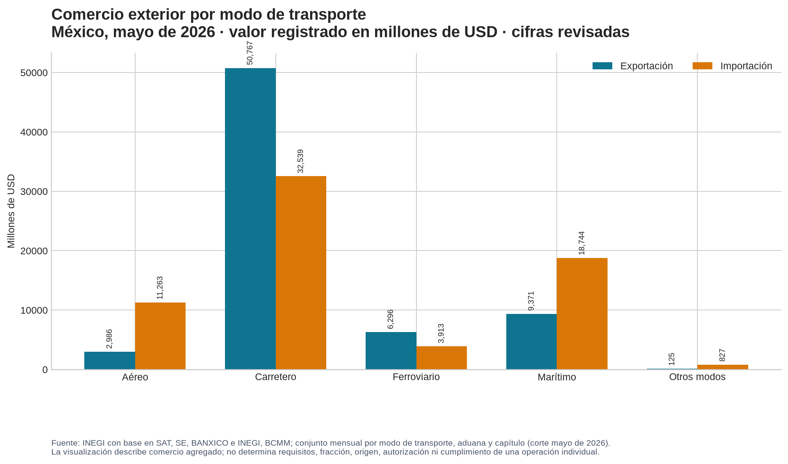

# Datos y visualizaciones de comercio exterior

Las estadísticas ayudan a describir **patrones agregados**: valor, flujo, periodo, país, producto, modo de transporte o aduana. Una regla, permiso, pedimento, acuse o expediente responde una pregunta distinta: qué aplica a una **mercancía y operación concretas**. La separación es indispensable. Un gráfico puede mostrar que cierto modo de transporte concentra un valor mensual; no determina una fracción, tasa, régimen, origen preferencial, autorización o cumplimiento de RRNA.

La fuente estadística principal para esta vista es la [Balanza Comercial de Mercancías de México (BCMM)](https://www.inegi.org.mx/programas/comext/), elaborada por INEGI con base en información de SAT, Secretaría de Economía, Banco de México e INEGI. La BCMM cubre operaciones definitivas de mercancías dentro de su periodo de estudio y ofrece documentación, tabulados, datos abiertos y metadatos.[1] La ficha del conjunto utilizado identifica valores en millones de dólares estadounidenses, valoración FOB, cobertura nacional, periodicidad mensual y mecanismos de confidencialidad.[2]

## Ejemplo reproducible: modo de transporte

El gráfico siguiente usa el conjunto mensual público de BCMM por modo de transporte, aduana y capítulo. Muestra exclusivamente las filas nacionales con valor **disponible** de mayo de 2026, en cifras revisadas. El archivo fuente, checksum, tabla derivada y script generador están versionados junto con la wiki; la línea de datos puede reconstruirse sin depender de una captura de pantalla.

> **Lectura correcta.** El transporte carretero concentra el mayor valor de exportación de este corte, mientras que el marítimo y el aéreo exhiben mayor valor de importación que de exportación. Es una descripción de los registros agregados en el conjunto, no una explicación causal ni una regla de logística, aduana o política comercial.

| Modo de transporte | Exportación | Importación | Estado de cifra |
|---|---:|---:|---|
| Aéreo | 2,985.623 | 11,262.652 | Revisadas |
| Carretero | 50,767.421 | 32,538.630 | Revisadas |
| Ferroviario | 6,295.717 | 3,913.489 | Revisadas |
| Marítimo | 9,371.075 | 18,743.769 | Revisadas |
| Otros modos | 124.654 | 826.783 | Revisadas |

*Valores en millones de USD, mayo de 2026. Fuente y transformación: [BCMM/INEGI][2]; tabla derivada `data/external/inegi_bcmm/bcmm_mtra_2026_05_transport_summary.csv`.*

## Cómo usar un gráfico sin sobreinterpretarlo

Empieza por registrar la **pregunta estadística**. Por ejemplo, “¿qué valor agregado se registró por modo de transporte en mayo de 2026?” es diferente de “¿qué aduana, ruta o requisito debe usar esta mercancía?”. La primera se responde con una serie y sus metadatos; la segunda exige hechos de producto, régimen, fecha, fuente jurídica y evidencia de operación.

La BCMM identifica valores confidenciales con una `C` en ciertas agregaciones para proteger información de informantes.[2] No sustituyas esas marcas por cero, ni las sumes como si fueran un valor conocido. También conserva el estatus de la cifra —preliminar, revisada, definitiva o ajustada— porque una serie puede revisarse. En el conjunto usado, el periodo 2022–2024 se identifica en la ficha como ajustado por revisiones publicadas.[2]

La valoración es FOB según la ficha del conjunto. No la conviertas sin más en valor en aduana, base de IGI, base de IVA, flete o costo logístico de una operación. Para esos conceptos consulta [valor en aduana](../wiki/contribuciones/valor-en-aduana.md), [impuestos de importación](../wiki/contribuciones/impuestos-importacion.md) y la [arquitectura de decisión y evidencia](../wiki/fundamentos/arquitectura-decision-evidencia.md).

## Mapas: contexto geográfico, no evidencia de cumplimiento

Un mapa puede ayudar a descubrir ubicación de aduanas, infraestructura o concentración de flujos. La capa cartográfica avanzada permanece en el proyecto especializado [`aduanamap-mx`](https://github.com/jccontrerasg08-cpu/aduanamap-mx), mientras que esta wiki conserva la [entrada ligera de aduanas y mapa](mapa.md) y la relación con fuentes operativas. Esta separación evita mantener una segunda copia manual de geodatos dentro de una wiki jurídica y operativa.

Antes de usar un punto o una capa, anota fuente, fecha, escala, coordenadas o cobertura, método y limitaciones. Una geolocalización no demuestra que una aduana esté habilitada para cierto régimen, horario, mercancía, trámite o medida. Contrasta siempre con la autoridad y fuente vigente aplicables a la operación.

## Secuencia mínima para una visualización verificable

| Etapa | Pregunta de control | Evidencia que debe quedar |
|---|---|---|
| Definir | ¿El dato describe un fenómeno agregado o una operación individual? | Pregunta, flujo, periodo, unidad y nivel de agregación. |
| Seleccionar | ¿La fuente es oficial, documentada y contemporánea al análisis? | URL, publicador, ficha/metadato, fecha de corte y versión. |
| Transformar | ¿El cálculo evita duplicar filas, mezclar unidades o tratar confidenciales como ceros? | Archivo fuente, checksum, script y tabla derivada. |
| Presentar | ¿Título, escala, leyenda y notas impiden una conclusión excesiva? | Gráfico, unidad, estatus de cifra y advertencias. |
| Conectar | ¿Qué fuente jurídica u operativa responde la decisión posterior? | Enlaces hacia clasificación, medida, despacho, programa o evidencia. |

La página de estadísticas históricas de la Secretaría de Economía sigue siendo útil para contexto 1993–2021, pero declara una actualización limitada a esos periodos.[3] Para un corte contemporáneo, utiliza la BCMM o la fuente oficial de fecha más próxima, y deja visible el desfase.

## Fuentes oficiales y de referencia

[1] [INEGI, *Balanza Comercial de Mercancías de México (BCMM)*](https://www.inegi.org.mx/programas/comext/), página del programa, cobertura institucional, calendario, documentación y datos abiertos.

[2] [INEGI, *BCMM mensual por modo de transporte, aduana y capítulo*](https://www.inegi.org.mx/app/descarga/ficha.html?tit=83071&ag=0&f=csv), ficha del conjunto, definición, cobertura, unidad, confidencialidad y fecha de modificación.

[3] [Secretaría de Economía, *Comercio Exterior: Estadísticas históricas*](https://www.gob.mx/se/acciones-y-programas/comercio-exterior-estadisticas-historicas?state=published), alcance histórico declarado de los cuadros.

## Ver también

[Herramientas SNICE: consulta, normatividad y evidencia](../wiki/fundamentos/herramientas-snice-y-fuentes.md) · [Aduanas y mapa](mapa.md) · [Logística internacional](../wiki/logistica/logistica-internacional.md) · [TIGIE y NICO](../wiki/clasificacion/tigie-nico.md) · [Trazabilidad de evidencia](../wiki/operacion/trazabilidad-evidencia.md)
