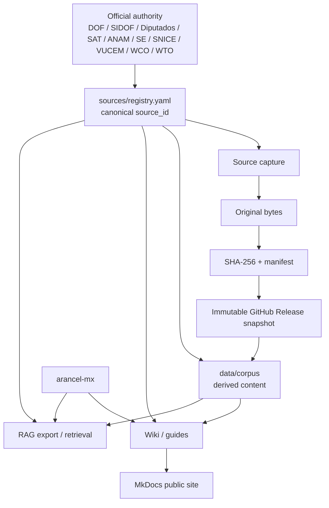
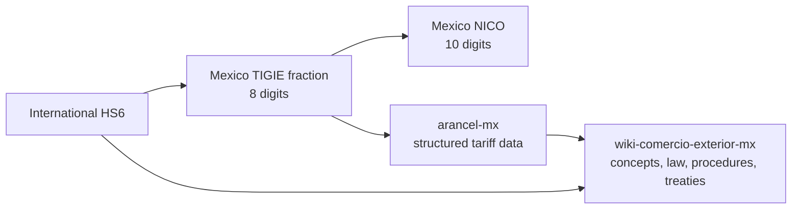
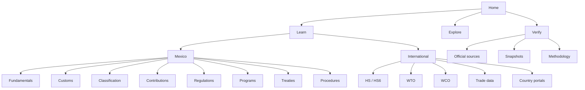
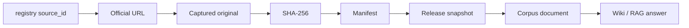
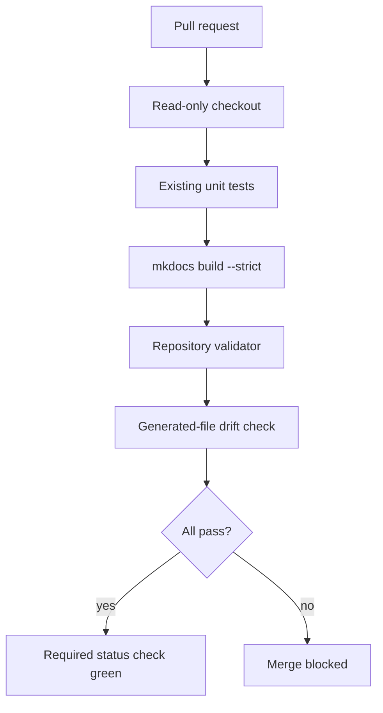
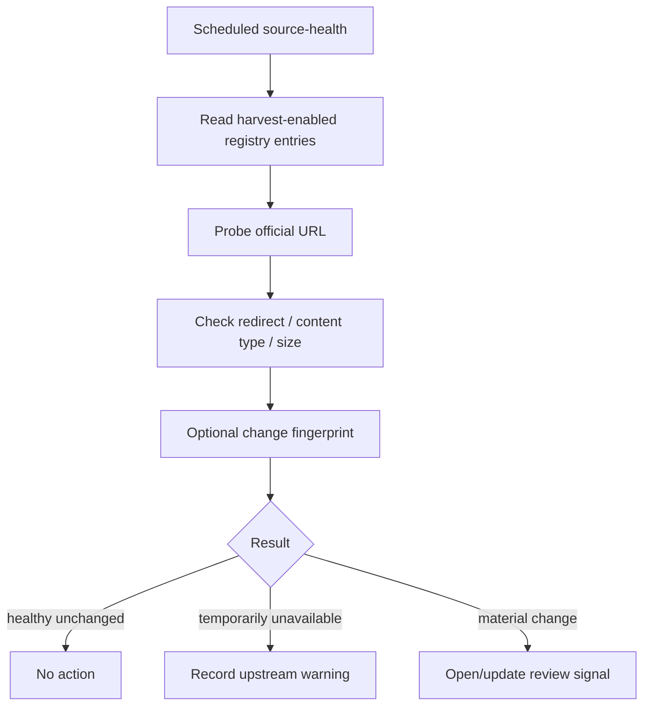
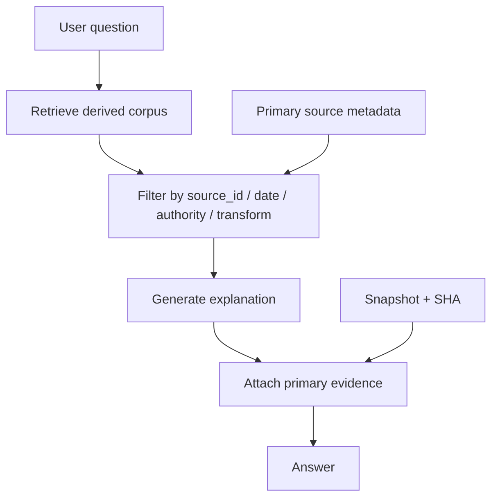

# Repository Hardening Design

Date: 2026-08-14  
Repository: `jccontrerasg08-cpu/wiki-comercio-exterior-mx`

## Objective

Turn `wiki-comercio-exterior-mx` into a public, Mexico-first, auditable knowledge repository that is easy for a person to use and difficult for the repository itself to silently corrupt.

The project remains intentionally simple:

- Markdown + YAML + Python validation
- MkDocs as the public documentation surface
- GitHub Releases for original official bytes
- `sources/registry.yaml` as the canonical source registry
- `arancel-mx` as the structured Mexican tariff/NICO data layer
- no vector database, backend, crawler platform, or database server in the core repository

The user-facing experience should expose commerce knowledge, not repository internals.

## Design principles

1. **Simple outside, strict inside.** Humans see learning paths and tools. CI sees schemas, provenance, hashes, temporal rules, and reproducibility.
2. **One identity per official source.** `source_id` is stable from registry to snapshot to corpus to wiki citations.
3. **Derived content never becomes legal authority.** Wiki and corpus content must identify when it is summary, paraphrase, interpretation, or guidance.
4. **Offline deterministic PR CI.** Government-site availability never blocks an unrelated pull request.
5. **Live monitoring is separate.** Source health and source-change detection run on schedules.
6. **Mexico deep, world thin.** Mexico gets legal and operational depth; international material provides the common HS6 layer, treaties, comparison sources, and official portals.
7. **More capabilities, fewer concepts.** New tools consume the same registry/provenance model instead of inventing parallel data stores.
8. **Every critical failure mode gets an explicit test.** Tests must prove that malformed data is rejected, not only that known-good files pass.

## Current repository baseline

The current repository already has the right core pieces:

| Layer | Current path | Intended responsibility |
|---|---|---|
| Public wiki | `docs/wiki/` | Explain what something is and how it applies |
| Human source catalog | `docs/catalog/` | Make official URLs discoverable |
| Canonical source registry | `sources/registry.yaml` | Machine-readable source identity and harvesting policy |
| Official evidence | `data/originals/` + Releases | Manifests, hashes, snapshot identity |
| RAG corpus | `data/corpus/` | Derived summaries and extracts |
| Site configuration | `mkdocs.yml` | Public navigation and presentation |
| Existing tests | `tests/test_career_wiki.py` | Basic page/citation structure |
| Required security | GitHub settings + ruleset | PR-only main, CodeQL, Dependabot, secret protection |

The current CI is still minimal: it runs the existing unittest and does not yet build MkDocs or validate provenance.

## Target architecture



### Boundary with `arancel-mx`



Rules:

- `wiki-comercio-exterior-mx` may explain HS2/HS4/HS6 and national extensions.
- It must not duplicate the canonical Mexican tariff table maintained by `arancel-mx`.
- Country-specific tariff-line systems may be documented and linked, but not mirrored wholesale into this repository.

## Public information architecture

The README remains short and acts as a project landing page. MkDocs becomes the actual knowledge product.



### User journeys

The primary navigation should answer practical questions rather than forcing users to know legal document names first:

- Import into Mexico
- Export from Mexico
- Classify a product
- Understand HS6 → TIGIE → NICO
- Check taxes and value
- Check RRNA/NOM
- Understand a treaty and origin rule
- Find an official source
- Verify which version/date supports a statement

Common tasks should be reachable in roughly three navigation steps or fewer.

## Source authority model

A single `authority` field is not enough. The registry should evolve toward explicit roles while remaining compact.

Suggested shape:

```yaml
id: mx_sidof_rgce_2026
jurisdiction: MEX
authority: DOF
evidence_class: primary_legal
document_family: rgce
document_role: base_rule
publication_date: 2025-12-27
effective_from: 2026-01-01
authoritative_for:
  - legal_publication
  - effective_date
url: https://...
```

Recommended authority roles:

| Source class | Typical role |
|---|---|
| DOF / SIDOF | Legal publication, amendments, effective dates |
| Cámara de Diputados | Consolidated federal legislation |
| SAT | Tax/customs administrative rules and procedures within competence |
| ANAM | Customs authority and operational material |
| SE / SNICE | Trade regulation, programs, RRNA, operational datasets |
| VUCEM | Electronic trade procedures |
| INEGI | Statistical/classification data |
| WCO | Harmonized System framework |
| WTO / UNCTAD / World Bank | International trade/tariff context |
| ICC | Incoterms® authoritative material |
| Wiki/corpus | Derived, non-binding content |

## Canonical provenance contract

Every derived legal or regulatory artifact must be traceable through one chain:



Minimum invariants:

- every manifest source reference exists in the registry
- every corpus source reference exists in the registry
- SHA-256 values are syntactically valid and, where bytes are locally available during verification, match those bytes
- publication/effective dates are coherent
- `current` documents cannot simultaneously declare a superseding document
- proposed/unpublished material cannot be treated as current legal authority

## Corpus metadata model

Each legal/regulatory corpus document should eventually have compact YAML front matter.

```yaml
---
corpus_schema: 1
document_id: rgce-2026-anexo-22
document_type: legal_summary
source_ids:
  - mx_sidof_rgce_2026_anexo_22
authority: derived_non_authoritative
transform: paraphrase
publication_date: 2026-01-15
effective_from: 2026-01-16
legal_checked_at: 2026-08-14
snapshot_release: originals-2026.08.13
---
```

Allowed transform classes should remain small:

- `extract`
- `paraphrase`
- `summary`
- `interpretation`
- `operational_guidance`

High-risk claims should eventually support section-level provenance where practical:

- article/rule references
- dates
- monetary amounts
- deadlines
- obligations/prohibitions
- tariff/classification identifiers
- NOM applicability
- treaty/origin claims

## Deterministic CI design

Required PR CI must be offline and reproducible.



Initial CI hardening stages:

1. read-only workflow permissions
2. `persist-credentials: false`
3. timeout and concurrency
4. pinned documentation dependency
5. current unit tests
6. `mkdocs build --strict`
7. repository validator
8. full-SHA-pinned GitHub Actions
9. required `repository-ci` status check in the ruleset

Live source checks do not belong in this required job.

## Repository validator

Prefer one understandable validator entry point instead of many tiny scripts:

```text
python -m scripts.validate_repository
```

Internally it may use small focused modules, but contributors should have one command.

Validation domains:

| Domain | Examples |
|---|---|
| Registry | YAML valid, unique IDs, valid jurisdictions/classes |
| Manifests | schema, source references, SHA format, sizes |
| Corpus | required front matter where adopted, valid source references |
| Wiki | internal links, source/citation expectations, one H1 |
| Temporal | publication/effective ordering, current/superseded consistency |
| Classification | HS2/HS4/HS6/MX8/NICO length and parent-prefix invariants where structured codes are present |
| Repository hygiene | no accidental official binaries in Git, no generated-file drift |

## Negative and adversarial testing

Passing known-good files is insufficient. The suite must prove that malformed examples fail.

Suggested invalid fixtures:

```text
tests/fixtures/invalid/
  duplicate-source-id.yaml
  unknown-source-id.md
  invalid-sha256.yaml
  effective-before-publication.yaml
  superseded-but-current.yaml
  proposed-as-current.yaml
  invalid-hs6.json
  invalid-mx-fraction.json
  invalid-nico.json
  corpus-without-authority.md
  broken-relative-link.md
```

### Property-style invariants

Where codes are represented structurally:

```text
len(HS2) = 2
len(HS4) = 4
len(HS6) = 6
len(MX fraction) = 8
len(NICO) = 10
HS4[:2] = HS2
HS6[:4] = HS4
MX8[:6] = HS6
NICO[:8] = MX8
```

### Metamorphic tests

Equivalent inputs should normalize identically:

```text
851713
8517.13
85 17 13
```

should resolve to the same HS6 when used by future tools.

### Differential tests

When two sources cover the same concept, differences are classified rather than silently overwritten:

- `CONSISTENT`
- `EXPECTED_DIFFERENCE`
- `TEMPORAL_DIFFERENCE`
- `REQUIRES_REVIEW`

Potential comparisons:

- `arancel-mx` vs official Mexican structured source
- manifest digest vs captured bytes
- wiki references vs corpus/source registry
- HS6 usage vs WCO-level hierarchy

### Mutation tests

The test suite should eventually survive deliberate truth corruption such as:

- 2026 → 2025
- one character of SHA-256 changed
- valid `source_id` → nonexistent ID
- current → proposed
- HS6 digit changed

If these mutations remain green, the relevant guard is missing.

## Source-health workflow

Live monitoring is separate from required CI.



A SAT/SIDOF/SNICE outage must not block a documentation PR.

## Generated artifacts

The repository should gradually reduce manual duplication.

Candidates to generate deterministically:

- `docs/catalog/catalog.md` from `sources/registry.yaml`
- root originals manifest from manifest fragments
- root `SHA256SUMS`
- `llms.txt` once its format is stable

CI should fail if regeneration changes tracked files.

## README strategy

Keep `README.md` concise. It should not become the encyclopedia.

Recommended sections:

1. one-paragraph purpose
2. quick navigation
3. Mexico vs international scope
4. repository layers
5. quick start
6. verification/provenance pointer
7. license/disclaimer

Detailed architecture, methodology, diagrams, workflows, and contributor guidance belong under `docs/`.

## Documentation diagrams and tables

Use Mermaid source-native diagrams inside Markdown rather than exported PNGs for architecture and flows because they are:

- diffable
- searchable
- editable
- accessible from source
- rendered by GitHub
- cheap to maintain

Use static images only when the content is inherently visual and Mermaid is insufficient.

Core diagrams to keep maintained:

1. repository layer architecture
2. provenance chain
3. HS6 → TIGIE → NICO boundary
4. PR CI flow
5. source-health flow
6. legal change/update flow
7. RAG evidence flow
8. public information architecture

## RAG architecture

The RAG layer remains downstream of verified sources.



The RAG system must not report model confidence as legal confidence. Prefer evidence status:

- primary source verified
- snapshot hash verified
- current as of date
- cross-source consistent
- derived interpretation requiring review

## Planned tools

Tools are introduced only when they can consume the same verified core.

### Near term

- source explorer
- HS → TIGIE → NICO explainer/link-out
- treaty explorer
- import/export procedural guides
- legal/source timeline
- citation builder

### Later

- compare jurisdictions at HS6
- compliance checklist generator
- “what applied on this date?” view
- structured RAG export
- source-change PR assistant

No tool should create a second source registry or duplicate `arancel-mx` tariff truth.

## GitHub repository hardening

Already configured or in progress:

- protected `main` via ruleset
- pull request requirement
- force-push/deletion protection
- CodeQL merge gate
- Dependabot
- private vulnerability reporting
- secret scanning/push protection
- read-only CI token permissions

Next repository-level steps:

- deterministic `repository-ci`
- full-SHA pinning for GitHub Actions
- required status check after the new job name is stable
- dependency update PRs validated by the same CI
- optional OpenSSF Scorecard after core CI contracts are stable

## Error handling policy

Fail closed for deterministic repository integrity:

- invalid schema
- duplicate identity
- broken provenance reference
- invalid hash format
- impossible temporal state
- MkDocs strict warnings

Warn rather than block for external availability:

- government portal timeout
- transient TLS problem
- temporary redirect failure

Escalate for human review rather than auto-rewrite when:

- an official source materially changes
- two authoritative sources disagree
- a legal amendment affects multiple derived pages
- a proposed rule becomes published/current

## PR decomposition

Implementation should be reviewable and sequential.

| PR | Scope | Main verification |
|---|---|---|
| 1 | Documentation CI gate | unittest + MkDocs strict |
| 2 | Full-SHA Action pinning | same CI remains green |
| 3 | Registry/manifest validator baseline | valid repo passes, invalid fixtures fail |
| 4 | Corpus front matter schema | corpus validation + migration subset |
| 5 | Canonical `source_id` relationships | no orphan registry/manifest/corpus refs |
| 6 | Generated catalog/root indexes | regeneration produces clean diff |
| 7 | Source-health scheduled workflow | live checks isolated from required CI |
| 8 | MkDocs information architecture | site build + link checks + UX journeys |
| 9 | Treaties/programs separation | navigation and source provenance tests |
| 10 | RAG export contract | deterministic export + evidence metadata |

Large legal-content audits remain separate coherent legal/source-event PRs.

## Success criteria

The hardening phase is successful when:

- a normal contributor needs one command to validate the repository
- `main` cannot merge unless deterministic repository CI and CodeQL pass
- the MkDocs site is built in strict mode on every PR
- source identities are unique and referentially valid
- malformed provenance fixtures are demonstrably rejected
- external site outages cannot make normal PR CI flaky
- every RAG-derived legal document can identify its official source(s)
- the README remains short while the docs contain the detailed diagrams/tables/flows
- the repository adds tools without adding competing sources of truth

## Explicit non-goals

Do not add during this hardening phase:

- a vector database
- a web backend
- Elasticsearch/OpenSearch
- Neo4j
- a generic scraping framework
- automatic LLM rewrites directly to `main`
- a duplicate world tariff database
- a duplicate Mexican tariff database
- copied restricted ICC/WCO proprietary text

These are unnecessary to reach the current project objective.
