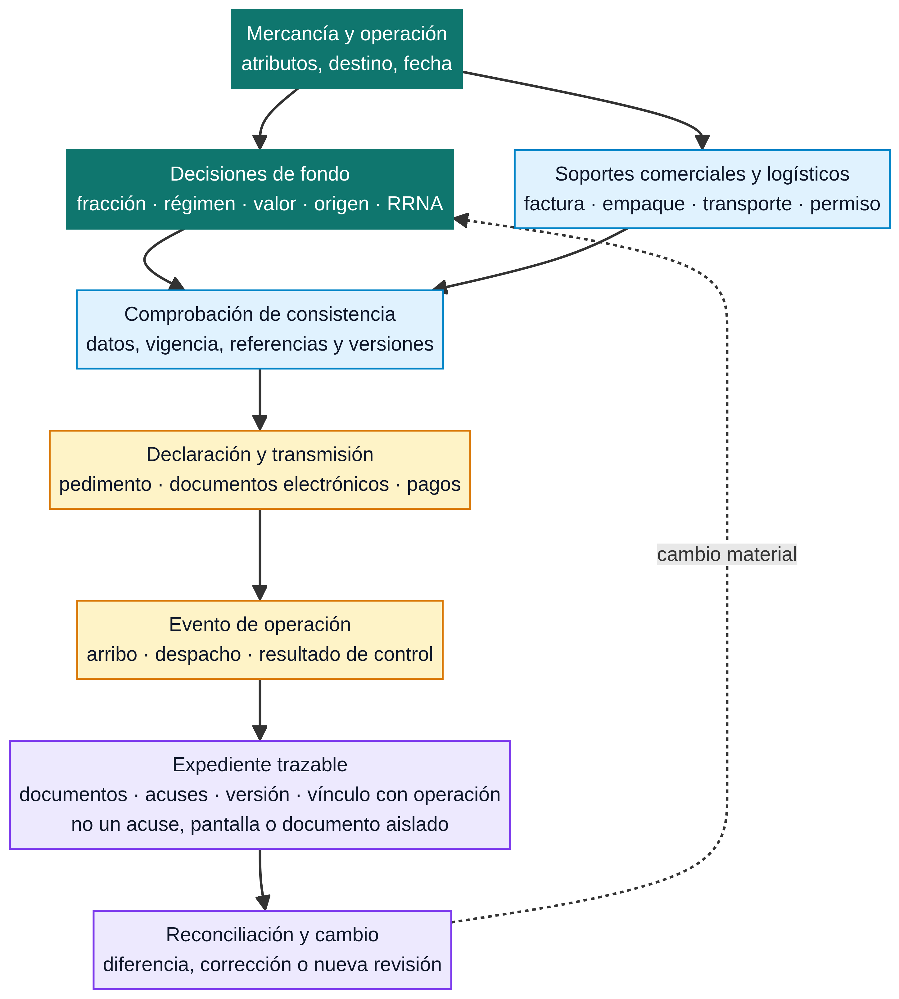

# Pedimento y RGCE

El **pedimento** es la declaración aduanera que articula una operación concreta: relaciona mercancía, régimen, clasificación, valor, origen, contribuciones, regulaciones no arancelarias y datos logísticos dentro de un evento de despacho. No es una simple factura, un recibo de pago ni un archivo que por sí solo pruebe que todos los requisitos de fondo se cumplieron. Su utilidad depende de que la información declarada pueda reconstruirse a partir de los instrumentos aplicables y los soportes de la operación.

Las **Reglas Generales de Comercio Exterior (RGCE)** y sus anexos desarrollan procedimientos, formatos, claves, plazos y condiciones operativas. El **Anexo 22** contiene el instructivo para el llenado del pedimento; por ello debe leerse junto con las RGCE aplicables, sus modificaciones y el régimen de la operación, no como una tabla aislada de campos.[1] [2]

> El pedimento conecta una decisión con un evento de sistema. La decisión se forma antes —con mercancía, fracción, valor, origen, RRNA y régimen— y debe poder verificarse después con documentos, acuses y registros relacionados.

*Diagrama de lectura elaborado para esta wiki. Resume la relación entre datos, documentos, transmisión y evidencia; no reemplaza RGCE, Anexo 22, una autorización ni la revisión de una operación concreta.*

## Cuatro capas que intervienen en una declaración

| Capa | Pregunta que responde | Ejemplos de fuente o soporte | Error que evita |
|---|---|---|---|
| Marco jurídico | ¿Qué obligación, régimen o formalidad existe? | Ley Aduanera, Ley de Comercio Exterior, LIGIE/TIGIE, tratado, decreto o acuerdo | Tratar una pantalla, formato o instructivo como si fuera la fuente que crea la obligación. |
| Regla operativa | ¿Cómo se declara, identifica, transmite o acredita el supuesto? | RGCE, Anexo 22 y anexos relacionados, modificaciones aplicables | Usar claves, identificadores o requisitos de una versión distinta. |
| Datos de operación | ¿Qué se está declarando en esta operación? | Ficha técnica, factura, valor, origen, documento de transporte, permiso, régimen y datos de las partes | Llenar una declaración con descripciones genéricas o datos no conciliados. |
| Evento y evidencia | ¿Qué se transmitió, validó, pagó o presentó, y qué lo soporta? | Pedimento, acuses, folios, comprobantes, anexos digitales y expediente documental | Confundir un acuse o pago con prueba completa de cumplimiento sustantivo. |

La arquitectura es deliberadamente separada. Una modificación de RGCE puede cambiar cómo se registra un supuesto sin modificar la regla de clasificación de la mercancía. Un permiso puede habilitar una condición de RRNA sin determinar la tasa de IGI. Un acuse electrónico puede demostrar que una transmisión ocurrió sin reemplazar la ficha técnica que sostiene la fracción o el documento que acredita origen.

## Qué información converge en el pedimento

El instructivo y los anexos se consultan para identificar cómo se expresa cada dato. Antes de llegar a esa etapa, el equipo necesita ordenar la información de fondo. La siguiente matriz ayuda a detectar huecos antes de transmitir.

| Familia de datos | Pregunta de control | Páginas para profundizar | Evidencia orientativa |
|---|---|---|---|
| Mercancía y clasificación | ¿La descripción técnica, fracción y NICO coinciden con el producto? | [TIGIE y NICO](../clasificacion/tigie-nico.md) | Ficha, catálogo, composición, función, razonamiento de clasificación y fuente temporal. |
| Régimen y destino | ¿Qué régimen encuadra la entrada, salida, permanencia o destino de la mercancía? | [Regímenes aduaneros](regimenes-aduaneros.md) | Contrato, programa, destino declarado, autorización y controles del régimen. |
| Valor y contribuciones | ¿Qué elementos se declararon y bajo qué método, tasa o tratamiento? | [Valor en aduana](../contribuciones/valor-en-aduana.md) · [Lectura de tarifa](../contribuciones/lectura-tarifa-y-tratos.md) | Factura, pagos, flete/seguro cuando corresponda, cálculo y fuente de tasa. |
| Origen y preferencia | ¿Se invoca una preferencia y qué hecho acredita el origen? | [Reglas de origen](../programas/reglas-de-origen.md) | Regla específica, certificación o declaración, información de producción y fecha. |
| RRNA y medidas separadas | ¿Hay permiso, aviso, NOM, cuota, cupo o medida que deba atenderse? | [RRNA](../clasificacion/rrna.md) · [Ciclo de vida de RRNA](../rrna/ciclo-de-vida-rrna.md) | Instrumento, autorización, vigencia, excepción, documento electrónico o acuse. |
| Logística y documentos | ¿Los datos de transporte, partes, bultos y llegada se concilian? | [Documentos](documentos.md) · [Logística internacional](../logistica/logistica-internacional.md) | Documento de transporte, lista de empaque, factura, referencias y eventos de arribo. |

No todos los campos ni documentos aplican a todas las operaciones. La matriz no pretende ser una plantilla transaccional ni suplir Anexo 22; sirve para verificar que la decisión que llegará al pedimento tenga una fuente identificable y que la declaración pueda reconciliarse después.

## Ruta de trabajo: de la decisión al evento de despacho

### 1. Delimita la operación y su fecha de corte

Antes de abrir una plantilla o interfaz, define la mercancía, régimen, fecha relevante, origen, partes y ruta logística. La fecha importa porque la tarifa, las RGCE, un anexo, una modificación, una medida temporal o una autorización pueden tener distinto efecto según su entrada en vigor. Para una operación histórica, conserva la versión de la norma e instructivo consultados; no sustituyas su contexto automáticamente por la regla vigente al momento de una auditoría posterior.

### 2. Construye un paquete de datos que pueda conciliarse

Clasificación, valor, origen, RRNA y logística no son módulos independientes cuando llegan a la declaración. Una fracción puede dirigir la búsqueda de una RRNA; el origen puede modificar el trato arancelario; el Incoterm y transporte pueden ser relevantes para el análisis de valor; el régimen puede condicionar plazos, inventarios o retornos. Si esos datos se preparan por equipos distintos, usa referencias comunes de producto, factura, operación y versión para evitar que cada área declare una versión diferente de la mercancía.

### 3. Lee RGCE y Anexo 22 como instrucciones de expresión, no como origen de los hechos

RGCE y Anexo 22 orientan cómo identificar datos y formalidades en la declaración. La publicación de RGCE 2026 y sus anexos debe contrastarse con modificaciones posteriores; la wiki registra tanto la publicación base como la primera modificación y los anexos actualizados que incluyen Anexo 22.[1] [2] Esto evita copiar una clave, identificador o regla de llenado desde un documento desactualizado.

Cuando un dato parece no encajar, vuelve a la fuente de fondo antes de forzar una clave. Por ejemplo, una duda sobre origen debe revisarse en el tratado y su regla; una duda sobre NICO en la LIGIE/TIGIE y su instrumento; una duda sobre requisito sanitario o NOM en el acuerdo y autoridad competente. El Anexo 22 organiza la declaración, pero no convierte una hipótesis incompleta en cumplimiento.

### 4. Transmite, valida y conserva la cadena de eventos

Dependiendo del régimen, autorización y canal operativo, quien promueve el despacho utiliza los sistemas y mecanismos previstos. Distingue al menos cuatro eventos: preparación del dato, transmisión/documento electrónico, pago o garantía cuando corresponda, y presentación o resultado de control. Cada evento puede producir un folio, acuse, referencia o comprobante. Conserva el vínculo entre ese resultado y los documentos que sustentan lo declarado.

La [Ventanilla Única y VUCEM](vucem.md) explica la capa de gestión digital; [ANAM](anam.md) separa autoridad, herramienta y evento de sistema. Ninguno de esos accesos convierte automáticamente al usuario en titular de una autorización ni sustituye los datos de la operación.

### 5. Reconcilia después de la liberación

La revisión posterior no comienza cuando existe una contingencia. Compara producto, factura, documentos de transporte, clasificación, valor, origen, RRNA, pedimento y acuses contra la versión aprobada de la operación. Si algo cambia —proveedor, componente, origen, monto, régimen, fecha de salida o permiso— identifica si el cambio afecta sólo un dato logístico o exige volver a clasificar, revaluar, revisar una preferencia o modificar evidencia.

La guía [Reconciliación y control de cambios](../operacion/reconciliacion-control-cambios.md) propone una forma de registrar esa comparación. La [Trazabilidad de evidencia](../operacion/trazabilidad-evidencia.md) explica cómo relacionar soporte, versión y evento de sistema sin conservar copias indiscriminadas.

## Anexo 22, anexos y publicaciones: cómo no perder el contexto

| Si necesitas responder… | Consulta primero | Después confirma |
|---|---|---|
| ¿Cómo se llena o identifica un dato del pedimento? | Anexo 22 vigente y su modificación, si existe | RGCE aplicable, régimen y fuente sustantiva del dato. |
| ¿Qué regla operativa o plazo aplica? | RGCE base y modificaciones | Transitorios, anexos referidos y fecha de la operación. |
| ¿Qué régimen puede declararse? | Ley Aduanera y reglas vinculadas | Autorización, programa, condición y evidencia de la mercancía. |
| ¿Qué documento o acuse debe transmitirse? | Trámite, RGCE, anexos y canal oficial | Autoridad competente, vigencia y vínculo con la operación. |
| ¿Qué se conserva para revisión posterior? | Obligación aplicable y política de expediente | Relación entre documento, versión, pedimento y evento electrónico. |

## Límites de una lectura rápida

El pedimento no debe usarse para deducir de forma automática que una mercancía es originaria, que un valor está aceptado sin revisión, que una RRNA está cubierta por una captura de pantalla o que el régimen se mantiene sin condiciones posteriores. Tampoco se debe concluir que una agencia aduanal privada es una autoridad: el agente o agencia participa en los términos de su patente o autorización; ANAM ejerce funciones de autoridad dentro del marco aplicable.[3]

La práctica más útil es tratar el pedimento como una **salida controlada de un conjunto de decisiones verificables**. Si una operación no puede explicar cada dato material con una fuente, una fecha y un soporte, el problema existe antes de la transmisión y no desaparece con la obtención de un folio.

## Fuentes oficiales y de referencia

[1] [SIDOF, *RGCE 2026 y Anexo 13*](https://sidof.segob.gob.mx/notas/5777199), publicación base de reglas; revisar anexos y modificaciones aplicables.

[2] [SIDOF, *Anexos 21–30 de RGCE 2026*](https://sidof.segob.gob.mx/notas/5778300) y [*Anexos 5, 22 y 29 de la primera modificación*](https://sidof.segob.gob.mx/notas/5787982), rutas oficiales para Anexo 22 y su actualización.

[3] [Ley Aduanera, Cámara de Diputados](https://www.diputados.gob.mx/LeyesBiblio/pdf/LAdua.pdf), marco de despacho, regímenes y figuras participantes; contrastar con RGCE y normativa vigente.

Vigente 2026 y contexto de anexos: `docs/catalog/mexico/rgce.md`. Catálogo general: `docs/catalog/catalog.md`. Resumen operativo local de Anexo 22 —que no sustituye la publicación oficial—: `data/corpus/anexo-22.md`.

## Ver también

[Proceso de despacho](proceso-despacho.md) · [Documentos de comercio exterior](documentos.md) · [Ventanilla Única y VUCEM](vucem.md) · [IMMEX](../programas/immex.md) · [Valor en aduana](../contribuciones/valor-en-aduana.md) · [Arquitectura de decisión y evidencia](../fundamentos/arquitectura-decision-evidencia.md)

> **Límite de uso:** esta guía organiza la lectura de una declaración. **No es asesoría legal.** Corrobora régimen, fecha, claves, anexos, requisitos y datos concretos contra las fuentes oficiales vigentes antes de transmitir.
