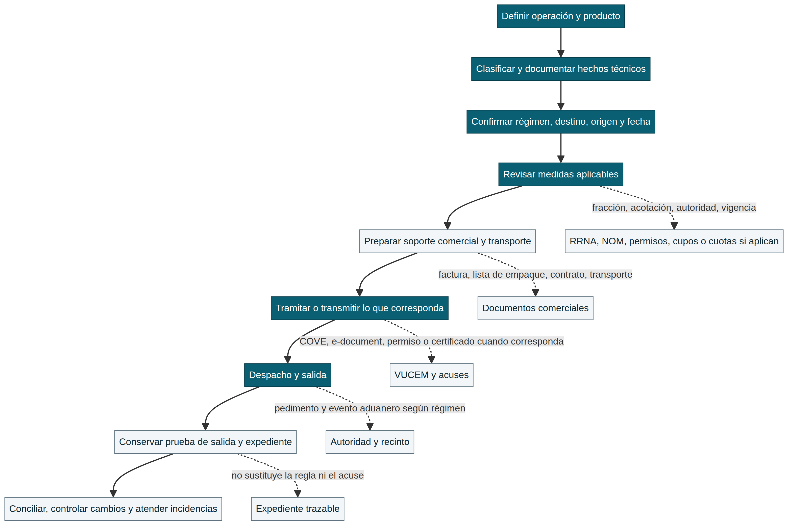

# Ruta de exportación: de la mercancía a la prueba de salida

Exportar no es repetir en sentido inverso una importación. La operación empieza por definir **qué mercancía saldrá, con qué finalidad, bajo qué régimen y hacia qué destino**, y termina cuando el exportador puede reconstruir qué se declaró, qué se transmitió, qué salió y qué cambió después. Esta página organiza ese recorrido. No asigna una fracción, autoriza una salida ni decide por sí sola el cumplimiento de una regulación; cada operación conserva sus hechos técnicos, fecha, destino, régimen, autoridad competente y evidencia.

> **Regla de lectura.** Una interfaz, un instructivo o un archivo transmitido no sustituyen una medida vigente ni la aceptación del trámite. A la inversa, conocer una regla no reemplaza el acuse, la declaración, el documento comercial ni la prueba de salida que exige la operación.

La orientación de siete pasos de SNICE sitúa primero la definición del producto y después la documentación, la confirmación de requisitos y el despacho. En la etapa documental pide revisar fracción arancelaria, regulaciones aplicables y documentos básicos; para el despacho menciona pedimento de exportación y soportes digitalizados como COVE, permisos, certificados de origen, escritos, avisos o documentos de transporte cuando corresponda.[1] Esta ruta conserva esa lógica, pero añade la evidencia y el control posterior que permiten revisar una operación después de su salida.

*El diagrama ordena preguntas y evidencia. No es una determinación de régimen, requisito o autorización.*

## 1. Del objetivo comercial a una operación definida

El primer dato no es el pedimento: es el caso de negocio. Documenta si se trata de una venta, retorno, reparación, muestra, transferencia, envío temporal u otra finalidad, y registra el destinatario, país de destino, Incoterm pactado, fecha prevista, medio de transporte y responsable interno. Estos datos no sustituyen el régimen aduanero, pero determinan qué preguntas deben verificarse después.

La ficha técnica debe describir composición, función, presentación, marca/modelo, unidades, fotografías técnicas cuando sean útiles y cualquier dato que cambie la clasificación o una medida. La clasificación no se justifica por el nombre comercial; se razona frente a la descripción de mercancía, la nomenclatura, notas y reglas aplicables. Consulta primero [TIGIE y NICO](../clasificacion/tigie-nico.md) y [Sistema Armonizado](../clasificacion/sistema-armonizado.md), y conserva la hipótesis junto con la fuente y fecha de la consulta.

| Pregunta previa | Por qué cambia el resto de la ruta | Evidencia mínima que debe quedar |
|---|---|---|
| ¿Qué mercancía y qué variante saldrán? | Cambia clasificación, acotación, documento comercial y medida posible. | Ficha técnica, SKU/modelo, composición, fotos o especificación. |
| ¿Cuál es la finalidad y el régimen? | Una venta definitiva, retorno o salida temporal no comparten necesariamente declaración, plazos ni control posterior. | Instrucción comercial, contrato/orden y decisión de régimen documentada. |
| ¿A qué país y bajo qué condición comercial? | Puede activar revisión de origen, certificado, requisito de destino, transporte o seguro. | Destino, Incoterm, comprador, cotización o contrato. |
| ¿Cuándo y por qué medio saldrá? | La fecha y el transporte afectan disponibilidad, documentos, acuses, ventanas logísticas y prueba de salida. | Plan de embarque, reserva, transportista y fecha objetivo. |

## 2. Clasificación no equivale a permiso de salida

Con la fracción y, cuando aplique, NICO, forma una **matriz de aplicabilidad**. Verifica si existe una medida de exportación, una regulación o restricción no arancelaria, una NOM, un permiso, aviso, cupo, cuota, certificación o requisito de origen. La pregunta correcta es “¿qué medida puede alcanzar esta operación en esta fecha y bajo esta acotación?”, no “¿la fracción tiene una regla?”.

La plataforma VUCEM facilita el envío electrónico de información para tramitar RRNA previas al despacho emitidas por varias dependencias; no crea la obligación ni resuelve la competencia de cada autoridad.[2] Por ello, la revisión debe seguir esta cadena: **fracción y hechos del producto → instrumento vigente → acotación/excepción → autoridad → trámite o documento → acuse y expediente**. El [mapa de medidas arancelarias y RRNA](../rrna/mapa-medidas-arancelarias-rrna.md) explica esa separación y el [ciclo de vida de una RRNA](../rrna/ciclo-de-vida-rrna.md) ayuda a conectar vigencia, trámite y control posterior.

No confundas el requisito mexicano con la condición comercial o regulatoria del país de destino. Esta wiki describe fuentes mexicanas; las exigencias del mercado extranjero deben verificarse con la autoridad, tratado, comprador, agente o asesor competente del destino, y registrarse como una fuente separada.

## 3. Armar el paquete comercial y de transporte

Antes de transmitir, alinea los documentos que describen la misma operación. La factura, lista de empaque, contrato u orden, instrucciones de transporte y datos de mercancía deben ser coherentes en partes, descripción, cantidades, unidades, valor, moneda, país de destino, términos comerciales y referencias de producto. SNICE presenta la lista de empaque y los documentos de transporte como apoyos para identificar bultos, preparar el embarque y conocer las condiciones del medio de transporte.[1]

La logística no decide el cumplimiento aduanero, pero una inconsistencia logística puede volver imposible reconstruir la operación. Una guía aérea, conocimiento de embarque, carta porte u otro soporte de transporte no sustituye al pedimento, igual que el pedimento no acredita por sí solo una entrega comercial. Consulta [Logística internacional](../logistica/logistica-internacional.md) para distinguir transporte, costos, Incoterm y evidencia.

| Capa | Pregunta de conciliación | Ejemplos de soporte | Límite de interpretación |
|---|---|---|---|
| Comercial | ¿Quién vende, compra y qué se pactó? | Orden, contrato, factura, cotización. | No determina por sí sola el régimen ni una preferencia. |
| Mercancía | ¿La descripción coincide con lo clasificado? | Ficha técnica, lista de empaque, SKU, fotos. | No reemplaza la clasificación razonada. |
| Transporte | ¿Qué bultos y medio se movilizan? | Reserva, guía aérea, conocimiento, carta porte u otro documento aplicable. | No prueba por sí solo despacho o salida aduanera. |
| Regulatoria | ¿Qué autorización, certificado o aviso aplica? | Permiso, certificado, aviso, consulta y acuse. | Debe revisarse contra vigencia, alcance y autoridad. |

## 4. Transmitir no es concluir el trámite

Cuando una medida o el flujo del despacho exige transmisión electrónica, identifica qué se presenta, quién lo hace, con qué datos y qué evidencia devuelve el sistema. VUCEM permite enviar información electrónicamente y gestionar trámites de distintas dependencias; su función es facilitar la transmisión e interoperabilidad, mientras que la autoridad competente decide el acto que le corresponde.[2]

Registra el identificador de solicitud, fecha y hora, versión del archivo, firmante o responsable, acuse, mensajes de validación y cualquier documento digital asociado. Para documentos comerciales digitalizados o transmitidos, enlaza cada acuse con la factura, operación, mercancía y declaración que corresponda. La guía [VUCEM](vucem.md) explica la separación entre plataforma, autoridad y evidencia; [Pedimento y RGCE](pedimento-rgce.md) explica por qué la declaración debe leerse junto con regla, anexo y operación concreta.

> **Control de cambio.** Si cambia la mercancía, cantidad, valor, destino, régimen, fecha, medio de transporte, permiso, certificado o condición de origen después de la transmisión, no asumas que el archivo previo sigue siendo utilizable. Registra el cambio y vuelve a validar la parte afectada de la ruta antes del despacho.

## 5. Despacho y salida: declarar el evento, no sólo los documentos

La Ley Aduanera y las RGCE regulan el despacho, los regímenes y los datos que se declaran; el Anexo 22 contiene el instructivo y apéndices del pedimento.[3] [4] [5] La guía de SNICE resume que, para exportar, la mercancía se presenta ante la autoridad junto con el pedimento y soportes digitalizados aplicables.[1] En una operación concreta, el régimen, clave, identificadores, aduana/sección, medio de transporte, contribuciones o exenciones, documentos y eventos deben verificarse contra la fuente vigente y sus transitorios.

No conviertas esta página en un instructivo de captura. El propósito es conservar el vínculo entre **dato declarado**, **hecho comercial**, **soporte transmitido** y **evento aduanero**. El mecanismo de selección automatizado, una validación de formato o la liberación logística no son una certificación general de que toda la operación cumple. El proceso y sus documentos deben poder explicarse después frente a la fuente que era aplicable en la fecha relevante.

## 6. Prueba de salida y expediente reconstruible

La salida no cierra el expediente. Conserva el pedimento o documento de la operación, acuses electrónicos, factura, lista de empaque, transporte, permisos o certificados aplicables, evidencia de la salida/entrega cuando exista, comunicaciones de cambio y registros de pago o cobro relevantes. La combinación exacta depende del régimen y de la operación; evita usar esta lista como una exigencia universal.

La pregunta de control es sencilla: **¿un tercero podría conectar la mercancía, el documento comercial, la declaración, el acuse, el transporte y el evento de salida sin adivinar?** Si la respuesta es no, falta una llave de conciliación. Usa referencias consistentes —por ejemplo operación interna, factura, SKU, pedimento, documento de transporte, e-document o acuse— y conserva la versión válida de cada soporte.

La guía [Trazabilidad de evidencia por operación](../operacion/trazabilidad-evidencia.md) organiza la conservación de soportes; [Reconciliación y control de cambios](../operacion/reconciliacion-control-cambios.md) ayuda a investigar diferencias sin convertir un hallazgo documental en una conclusión jurídica inmediata.

## 7. Control posterior: volver atrás cuando cambian los hechos

Una ruta verificable incluye su propia salida de emergencia. Vuelve a la etapa anterior si se modifica la descripción técnica, clasificación, destino, origen, régimen, valor, cantidad, permiso, certificado, fecha de vigencia o medio de transporte. Identifica qué decisión se basó en el dato anterior, qué archivo o declaración puede quedar afectado y qué responsable debe aprobar la corrección.

| Cambio detectado | Etapa que se reabre | Pregunta antes de continuar | Evidencia de cierre |
|---|---|---|---|
| Descripción, composición o modelo | Clasificación y medidas | ¿La fracción, NICO o acotación sigue sosteniéndose? | Ficha corregida, análisis actualizado y fuente de consulta. |
| Destino, cliente u origen | Medidas, origen y documentos | ¿Cambia preferencia, certificado, requisito de destino o restricción? | Contrato/orden actualizada, revisión de origen y soporte aplicable. |
| Cantidad, valor o moneda | Paquete comercial y declaración | ¿Factura, lista, transmisión y declaración aún coinciden? | Documento corregido, acuse o control de versión. |
| Fecha, transporte o aduana | Trámite y despacho | ¿Siguen vigentes permiso, disponibilidad, ventana logística y ruta? | Reserva actualizada, consulta de vigencia y evento trazable. |

## Fuentes oficiales y de referencia

[1] [SNICE, *Aprende a Exportar*](https://www.snice.gob.mx/cs/avi/snice/comercio.aprende.exportar.html), guía institucional de pasos, documentos y despacho de exportación.

[2] [VUCEM, *¿Qué es la Ventanilla Única de Comercio Exterior Mexicana?*](https://www.ventanillaunica.gob.mx/vucem/ventanillaunica.html), alcance institucional de la plataforma y trámites electrónicos de RRNA.

[3] [Cámara de Diputados, *Ley Aduanera*](https://www.diputados.gob.mx/LeyesBiblio/pdf/LAdua.pdf), texto legal de referencia para despacho y regímenes.

[4] [SAT, *Reglas Generales de Comercio Exterior para 2026*](https://www.sat.gob.mx/minisitio/NormatividadRMFyRGCE/documentos2026/rgce/rgce/ReglasGeneralesComercioExteriorpara2026.pdf), reglas y capítulos aplicables sujetos a modificaciones y transitorios.

[5] [SAT, *Anexo 22 de las RGCE para 2026*](https://www.sat.gob.mx/minisitio/NormatividadRMFyRGCE/documentos2026/rgce/anexos/Anexo22delasRGCEpara2026.pdf), instructivo y apéndices del pedimento.

## Ver también

[Clasificación y NICO](../clasificacion/tigie-nico.md) · [Mapa de medidas arancelarias y RRNA](../rrna/mapa-medidas-arancelarias-rrna.md) · [Pedimento y RGCE](pedimento-rgce.md) · [VUCEM](vucem.md) · [Logística internacional](../logistica/logistica-internacional.md) · [Trazabilidad de evidencia](../operacion/trazabilidad-evidencia.md)
