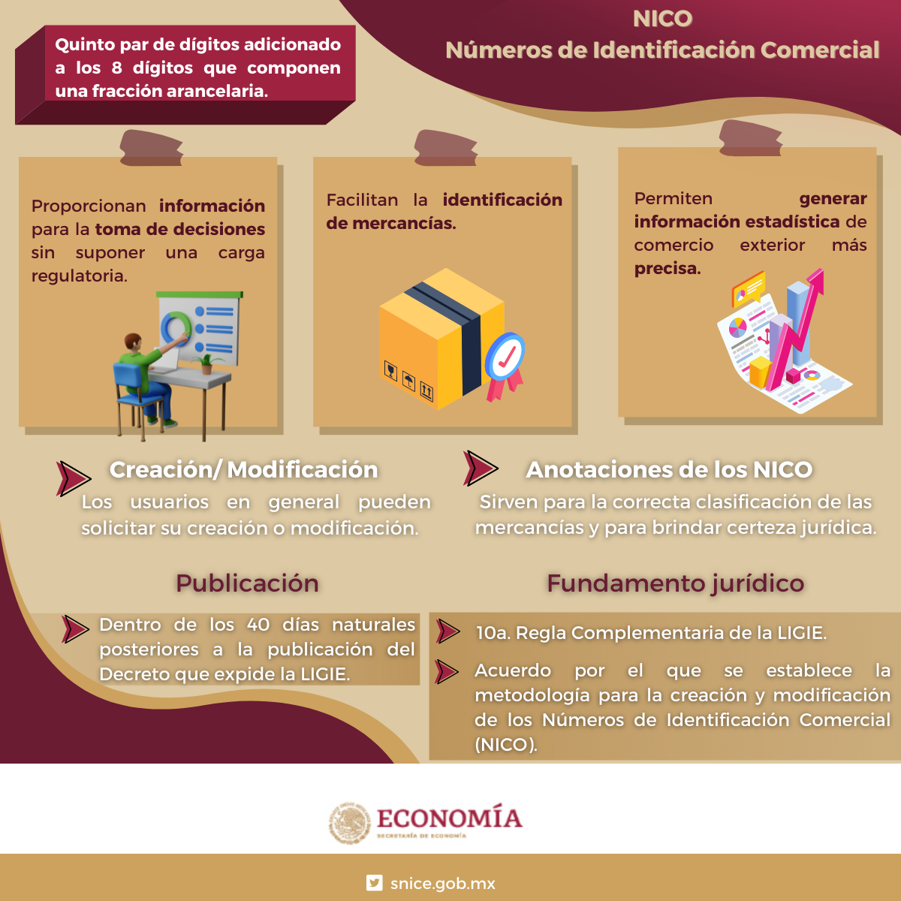

# TIGIE, NICO y fracción arancelaria

La clasificación arancelaria no consiste en encontrar una palabra parecida dentro de un buscador. Es el proceso de vincular una mercancía descrita técnicamente con la estructura jurídica de la tarifa, sus reglas, notas y desagregaciones nacionales. El resultado debe poder explicar **qué mercancía se analizó, por qué se eligió una fracción, qué versión de la tarifa se consultó, qué NICO corresponde si aplica y qué consecuencia operativa se revisó después**.

*Infografía institucional enlazada por [SNICE, LIGIE: Acerca de](https://www.snice.gob.mx/cs/avi/snice/ligie.info22.html). Su finalidad es orientar sobre el NICO; la LIGIE/TIGIE vigente, las notas y publicaciones posteriores siguen siendo la fuente para confirmar una clasificación y su tratamiento.*

## De una mercancía a una decisión verificable

La **fracción arancelaria** es el código nacional de ocho dígitos con el que se identifica la mercancía dentro de la Tarifa de la Ley de los Impuestos Generales de Importación y de Exportación. El **NICO** agrega un quinto par de dígitos cuando corresponde, para dar mayor detalle de identificación comercial y estadística. La explicación institucional de SNICE indica que el NICO no supone por sí mismo una carga regulatoria; por ello no debe confundirse con una tasa adicional, un permiso o una RRNA.[1]

La LIGIE/TIGIE es más que una lista de códigos. La estructura combina secciones, capítulos, partidas, subpartidas, fracciones, reglas generales y complementarias, además de notas legales que pueden excluir, incluir o precisar mercancías. Una respuesta basada sólo en una descripción corta —por ejemplo, “equipo”, “refacción”, “ropa” o “juguete”— suele ser insuficiente, porque material, composición, función, grado de elaboración, presentación, unidad y uso pueden modificar el análisis.[2]

> Una clasificación bien documentada no afirma que una fracción “conviene”. Explica una hipótesis técnica y jurídica, identifica la fuente consultada y deja visibles los datos que podrían cambiar la conclusión.

## Cinco objetos que no deben confundirse

| Objeto | Para qué sirve | Lo que permite hacer | Lo que no prueba por sí solo |
|---|---|---|---|
| Mercancía física y ficha técnica | Identificar composición, función, presentación y uso | Formular la hipótesis de clasificación | Que la fracción elegida sea correcta sin aplicar reglas y notas. |
| LIGIE/TIGIE y sus notas | Determinar la estructura jurídica de clasificación y el arancel general | Interpretar sección, capítulo, partida, subpartida y fracción | Que un decreto, preferencia, cuota o RRNA posterior no modifique el resultado operativo. |
| NICO | Desagregar una fracción a diez dígitos cuando corresponda | Identificar comercialmente o estadísticamente con mayor precisión | Una obligación independiente, salvo que un instrumento concreto la establezca. |
| Herramienta de consulta | Localizar rutas, textos, correlaciones o información relacionada | Reducir tiempo de búsqueda y documentar la fuente consultada | La vigencia jurídica de un resultado aislado. |
| Declaración o pedimento | Manifestar datos de una operación determinada | Registrar la fracción y demás datos transmitidos | La corrección sustantiva de soportes, notas, valor, origen o RRNA. |

Esta separación aclara por qué la clasificación toca muchas zonas de la wiki. La fracción puede activar una RRNA, orientar la lectura de un permiso, relacionarse con un programa, afectar una preferencia de origen, cambiar la tasa general o servir como llave de conciliación entre ficha, factura, documento de transporte y pedimento. No todas esas consecuencias ocurren siempre; dependen del régimen, fecha, origen, medida concreta y datos de la operación.

## Ruta de clasificación: del producto a la fracción y después a las consecuencias

### 1. Delimita la mercancía antes de buscar un código

Reúne una descripción que pueda ser contrastada. La información útil normalmente incluye nombre comercial y técnico, composición o materiales, función principal, modo de operación, presentación, componentes, medidas, capacidad, unidad, catálogo, fotografías técnicas y, cuando existe, ficha de fabricante o laboratorio. No todos los productos requieren la misma evidencia, pero una descripción genérica rara vez permite comparar con precisión una nota legal.

No reemplaces la descripción técnica con el texto de una factura si éste es demasiado amplio. “Accesorio”, “repuesto” o “equipo” pueden ser términos comerciales válidos y, aun así, no responder a la pregunta que plantea la tarifa. Registra qué dato técnico provino de qué documento y qué versión se usó; ese vínculo será necesario si después se modifica la clasificación o se revisa la operación.

### 2. Formula una hipótesis dentro de la estructura de la tarifa

Parte de la función, material o naturaleza que parezca más relevante y revisa la jerarquía completa: sección, capítulo, partida, subpartida y fracción. Después lee las reglas generales y complementarias pertinentes, así como las notas de sección y capítulo. Las reglas no son una introducción decorativa: orientan cómo abordar mercancías incompletas, mezclas, conjuntos, envases y otros supuestos de interpretación.[2]

La hipótesis debe ser reversible. En vez de registrar únicamente una fracción, conserva una nota breve de razonamiento: “se revisó esta partida por función; se descartó esta otra por la nota X; la característica que inclina la conclusión es Y”. Ese nivel de trazabilidad no convierte la decisión en asesoría legal, pero permite revisar el efecto de un nuevo dato sin empezar desde cero.

### 3. Identifica el NICO y las anotaciones aplicables

Una vez delimitada la fracción de ocho dígitos, revisa si hay NICO aplicable y si existen anotaciones o instrumentos que utilicen esa desagregación. SNICE describe al NICO como información adicional para la identificación de mercancías y la generación de estadísticas; la infografía institucional también señala que puede solicitarse creación o modificación bajo la metodología correspondiente.[1]

La pregunta correcta no es “¿el NICO agrega otro arancel?”, sino “¿esta fracción requiere una desagregación NICO y qué instrumento usa ese dato?”. Si un permiso, aviso, estadística, padrón o sistema exige un NICO, verifica su fundamento y vigencia de manera separada. Si no existe una obligación identificada, no inventes una carga por el solo hecho de que el código tenga diez dígitos.

### 4. Revisa tratamiento arancelario y controles paralelos

La fracción abre la puerta a la lectura de la tasa general, pero no termina el análisis. Revisa si la fecha de operación cae en una modificación, si existe una preferencia que exige origen, si procede un programa como PROSEC, si hay arancel-cupo, cupo o cuota compensatoria, y si una RRNA se identifica por esa fracción. La guía [Lectura de tarifa y tratamientos](../contribuciones/lectura-tarifa-y-tratos.md) explica por qué estas capas no son intercambiables.

En particular, no concluyas que un país de embarque demuestra origen preferencial, ni que una tasa general descarta una medida no arancelaria. Las reglas de origen, la documentación y el régimen tienen funciones propias. Continúa en [Reglas de origen](../programas/reglas-de-origen.md), [RRNA](rrna.md), [Valor en aduana](../contribuciones/valor-en-aduana.md) y [Cuotas compensatorias](../contribuciones/cuotas-compensatorias.md) según el supuesto.

### 5. Conserva evidencia y controla el tiempo

Anota la fecha de consulta, la versión de la fuente, los datos de producto empleados y los instrumentos que se revisaron. Si una operación utiliza una fracción histórica, no sustituyas automáticamente su contexto por la tarifa vigente al día de la revisión. Los decretos, transitorios, correlaciones y cambios de nomenclatura pueden requerir reconstruir la fuente aplicable a la fecha de la operación.

El [Ciclo de vida de una RRNA](../rrna/ciclo-de-vida-rrna.md) muestra cómo seguir instrumento, fracción, vigencia, trámite y evidencia; la [Trazabilidad de evidencia](../operacion/trazabilidad-evidencia.md) explica cómo relacionar ese razonamiento con soporte, transmisión y expediente posterior.

## Herramientas oficiales: localizar no equivale a resolver

Las herramientas de consulta reducen fricción, pero la arquitectura de la wiki distingue entre **buscar**, **interpretar**, **declarar** y **probar**. Usa la siguiente matriz para no asignar a una plataforma una función que no le corresponde.

| Herramienta o fuente | Uso correcto | Precaución esencial |
|---|---|---|
| [LIGIE vigente, Cámara de Diputados](https://www.diputados.gob.mx/LeyesBiblio/pdf/LIGIE_2022.pdf) | Leer versión consolidada de la Ley y la Tarifa | Contrastar con decreto, publicación y transitorios posteriores aplicables a la fecha. |
| [SNICE, LIGIE: Acerca de](https://www.snice.gob.mx/cs/avi/snice/ligie.info22.html) | Orientarse sobre LIGIE, NICO, notas y rutas de consulta | Es una capa institucional de orientación, no reemplaza el texto normativo. |
| [SNICE, Mi Fracción Arancelaria](https://www.snice.gob.mx/cs/avi/snice/hce.mi.fraccion.arancelaria.html) | Localizar información por fracción cuando el servicio esté disponible | Registra fecha y resultados; no automatices ni extraigas datos de un portal que no ofrece una interfaz pública para ello. |
| [INEGI, TIGIE–SCIAN](https://www.inegi.org.mx/app/tigie/) | Consultar correspondencias de clasificación económica | Una correspondencia estadística no sustituye la interpretación de la tarifa ni las notas legales. |
| [`arancel-mx`](https://github.com/jccontrerasg08-cpu/arancel-mx) | Trabajar con tasas y datos estructurados del proyecto relacionado | Verifica proveniencia, fecha y límites del dataset antes de usarlo para una conclusión. |

## Errores de diseño que suelen propagarse

El primer error es tomar el resultado de una herramienta como conclusión definitiva. El segundo es guardar sólo el código y perder la descripción técnica que permitió llegar a él. El tercero es corregir la fracción sin revisar las capas que dependen de ella: RRNA, origen, valor, programa, pedimento y evidencia. El cuarto es usar una imagen histórica, una correlación o una tabla consolidada como si acreditara la vigencia actual.

La prevención más simple es crear una ficha de decisión mínima: mercancía y atributos relevantes; hipótesis de capítulo/partida; notas y reglas revisadas; fracción y NICO; fecha y fuentes; tratamientos o controles que deben verificarse después; responsable y estado de la evidencia. Esa ficha puede ser breve, pero debe conservar la relación entre el dato técnico, la fuente jurídica y el evento operativo.

## Fuentes oficiales y de referencia

[1] [SNICE, *LIGIE: Acerca de*](https://www.snice.gob.mx/cs/avi/snice/ligie.info22.html), explicación institucional de NICO, notas y rutas de consulta; consultada el 16 de agosto de 2026.

[2] [Cámara de Diputados, *LIGIE vigente*](https://www.diputados.gob.mx/LeyesBiblio/pdf/LIGIE_2022.pdf), texto consolidado que contiene la Tarifa y reglas de interpretación; contrastar con decretos y transitorios posteriores.

[3] [INEGI, *Catálogo TIGIE–SCIAN*](https://www.inegi.org.mx/app/tigie/), herramienta de correspondencia económica; su disponibilidad debe verificarse al momento de consulta.

El [catálogo de fuentes](../../catalog/mexico/arancel.md) conserva el contexto de procedencia de los recursos locales y oficiales utilizados por la wiki; su ruta de repositorio es `docs/catalog/mexico/arancel.md`.

## Ver también

[Sistema Armonizado](sistema-armonizado.md) · [Lectura de tarifa y tratamientos](../contribuciones/lectura-tarifa-y-tratos.md) · [Regulaciones y restricciones no arancelarias](rrna.md) · [Pedimento y RGCE](../aduana/pedimento-rgce.md) · [Arquitectura de decisión y evidencia](../fundamentos/arquitectura-decision-evidencia.md)

> **Límite de uso:** esta guía organiza preguntas y fuentes. **No es asesoría legal.** Una clasificación aplicable a una operación concreta requiere contrastar mercancía, régimen, fecha, notas legales, instrumentos posteriores y evidencia técnica.
