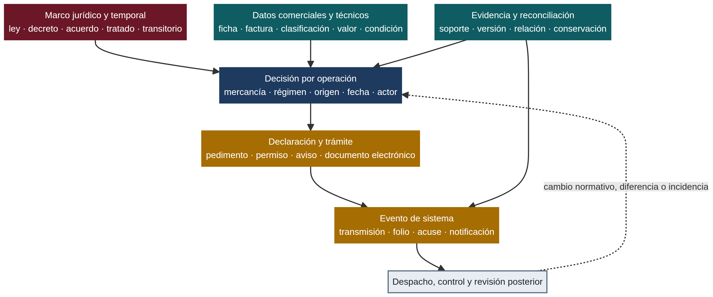

# Arquitectura de decisión y evidencia por operación

Una operación de comercio exterior no es una fila en una tarifa, un permiso aislado ni un pedimento por sí solo. Es una **decisión documentada** que relaciona una mercancía concreta con un régimen, un origen, una fecha, uno o más instrumentos jurídicos y la evidencia necesaria para sostener lo declarado. Esta guía explica cómo se conectan esas piezas antes, durante y después del despacho. Úsala para construir un modelo mental de la operación; para requisitos específicos, sigue las páginas especializadas y la fuente oficial correspondiente.

## La idea central: cuatro flujos simultáneos

El despacho suele describirse como una secuencia: clasificar, revisar requisitos, transmitir, pagar y liberar. Esa secuencia es útil, pero incompleta. Mientras ocurre, avanzan cuatro flujos que deben permanecer consistentes entre sí: el flujo jurídico y temporal, el flujo de datos técnicos y comerciales, el flujo de transmisión ante sistemas y el flujo de evidencia para revisión posterior.

*Diagrama propio de la wiki. Resume relaciones funcionales entre flujos; no sustituye las formalidades, plazos ni competencias de un instrumento concreto.*

La Ley de Comercio Exterior aporta parte del nivel macro: prevé facultades para establecer aranceles, RRNA, reglas de origen, permisos, cupos y programas, y dispone que las RRNA se identifiquen con las fracciones y la nomenclatura de la tarifa.[1] La Ley Aduanera conecta ese marco con la ejecución: regula la entrada y salida de mercancías, el despacho y los hechos derivados; además, define el pedimento y prevé el uso del sistema electrónico aduanero cuando la transmisión electrónica procede.[2]

> El orden de las tareas puede ser secuencial, pero la **coherencia de la operación** es simultánea. Una modificación a la mercancía, al origen, al régimen o a la fecha puede obligar a revisar clasificación, RRNA, trato arancelario, datos declarados y evidencia ya preparada.

## Nivel macro: norma, autoridad y tiempo

El nivel macro responde tres preguntas que deben resolverse antes de confiar en una pantalla, un formato o una tabla exportada: **qué instrumento crea la obligación**, **qué autoridad es competente** y **desde cuándo aplica al supuesto**. No basta con conocer el nombre de una ley; hay que distinguir la función de cada fuente dentro de la decisión.

| Componente macro | Qué determina | Ejemplo de pregunta | Error de diseño frecuente |
|---|---|---|---|
| Constitución, leyes y tratados | Facultades, obligaciones generales, tratamientos y límites de la regulación | ¿La materia se rige por Ley Aduanera, LIGIE, Ley de Comercio Exterior, tratado u otra ley sectorial? | Tratar una ficha operativa como si sustituyera el instrumento que crea la obligación. |
| Decreto, acuerdo, resolución o regla | Medida específica, alcance, fracción, condición, excepción, vigencia o procedimiento | ¿La RRNA, cupo, cuota o cambio de arancel cubre esta mercancía y este periodo? | Leer sólo el encabezado y omitir tablas, anexos o transitorios. |
| Autoridad competente | Quién expide, administra, recibe, vigila o resuelve | ¿La SE expide la medida, una autoridad sectorial verifica el requisito y la aduana controla el despacho? | Concluir que todas las autoridades hacen lo mismo porque intervienen en una plataforma común. |
| Tiempo jurídico | Publicación, entrada en vigor, transición, reforma y fecha de operación | ¿Qué versión gobernaba al momento del embarque, transmisión o despacho? | Aplicar una versión consolidada actual a un hecho anterior sin reconstruir su vigencia. |

Este nivel también explica por qué la misma fracción puede producir resultados distintos según el origen, el régimen, la fecha o la finalidad de la operación. La Ley de Comercio Exterior prevé aranceles, modalidades como arancel-cupo y medidas no arancelarias con distintos instrumentos y supuestos; las reglas de origen pueden importar para preferencias, marcado, cupos o cuotas compensatorias.[1] Por eso, una fracción es un **identificador de partida para la investigación**, no una respuesta jurídica completa.

Para consultar este plano, comienza por [Marco jurídico](marco-juridico.md), continúa con la [Biblioteca de instrumentos prioritarios](biblioteca-instrumentos-prioritarios.md) y registra la fecha relevante en [Cambios 2026](../aduana/cambios-2026.md). Cuando una conclusión depende de una publicación, conserva también el evento DOF/SIDOF y sus transitorios, no sólo un enlace a un texto consolidado.

## Nivel de decisión: convertir la norma en una hipótesis comprobable

El nivel de decisión conecta el marco general con una operación real. Aquí la pregunta ya no es “¿qué dice la ley?”, sino “**bajo qué condiciones esta norma afecta a esta mercancía, en esta operación y en esta fecha?**”. Una respuesta robusta no salta directamente al pedimento: primero formula una hipótesis que pueda ser refutada o confirmada con datos y evidencia.

La unidad mínima de análisis puede representarse como una ficha de decisión. No es una plantilla que sustituya el análisis; es un modo de evitar que la información se disperse entre correos, catálogos, facturas y portales.

| Campo de decisión | Qué debe capturarse | Qué puede cambiar si es incorrecto | Dónde profundizar |
|---|---|---|---|
| Mercancía | Descripción técnica, composición, uso, presentación, cantidad y unidad | Clasificación, NOM, permiso, valor o alcance de una medida | [Sistema Armonizado](../clasificacion/sistema-armonizado.md) · [TIGIE y NICO](../clasificacion/tigie-nico.md) |
| Régimen y finalidad | Importación/exportación, definitivo/temporal, transformación, retorno, destino | Obligaciones, plazos, control de inventarios y tratamiento jurídico | [Regímenes aduaneros](../aduana/regimenes-aduaneros.md) |
| Origen y procedencia | País de origen, producción, preferencia, marcado o medida aplicable | Preferencia arancelaria, cuota, cupo, certificado o cuota compensatoria | [Reglas de origen](../programas/reglas-de-origen.md) · [TLC y T-MEC](../programas/tlc-tmec.md) |
| Valor y contraprestación | Precio pagado o por pagar, incrementables, condiciones comerciales y soportes | Base gravable, IGI, IVA, contribuciones y riesgo de discrepancia | [Valor en aduana](../contribuciones/valor-en-aduana.md) |
| Fecha de control | Fecha de operación, publicación, entrada en vigor, transmisión y despacho | Instrumento aplicable, transición, vigencia de permiso o saldo de cupo | [Cambios 2026](../aduana/cambios-2026.md) |
| Actor y representación | Importador/exportador, agente o agencia, titular de permiso y autoridad | Capacidad, titularidad, notificación, trazabilidad y responsabilidades | [Agente y agencia aduanal](../aduana/agente-agencia-aduanal.md) |

Este modelo evita un error común: tratar cada requisito como una columna independiente. En realidad, una descripción técnica puede exigir reclasificación; la reclasificación puede modificar una RRNA; el cambio de RRNA puede cambiar el trámite o el documento que se transmite; y la corrección puede obligar a reconciliar el expediente con datos ya capturados. La decisión debe poder absorber esa retroalimentación sin perder qué versión se usó y por qué.

## Nivel micro: datos, declaración y evento de sistema

En el nivel micro se materializa la hipótesis de decisión. Aquí aparecen la factura, ficha técnica, contrato, documento de transporte, certificado, permiso, pedimento, e-document, folio y acuse. Cada objeto responde una pregunta diferente, por lo que no conviene tratarlos como sustitutos intercambiables.

La Ley Aduanera define el pedimento como una declaración electrónica que contiene información sobre mercancías, tráfico, régimen y formalidades aplicables. También distingue documento electrónico y documento digital, y prevé que, cuando corresponda, los trámites ante la autoridad se realicen mediante el sistema electrónico aduanero.[2] De forma complementaria, VUCEM se presenta institucionalmente como una plataforma para transmitir información una sola vez y gestionar trámites de distintas dependencias, incluidos instrumentos de la Secretaría de Economía.[3]

| Objeto micro | Pregunta que responde | Lo que sí acredita | Lo que no acredita por sí solo |
|---|---|---|---|
| Ficha técnica, catálogo o laboratorio | ¿Qué es materialmente la mercancía? | Atributos usados para clasificar o verificar alcance | Que una clasificación, RRNA o trato esté jurídicamente resuelto. |
| Factura, contrato o comprobante de pago | ¿Cuál es la relación comercial y el precio? | Datos de la transacción y soporte del valor, según el caso | Que el valor en aduana esté integrado correctamente sin analizar incrementables y condiciones. |
| Permiso, aviso, certificado o constancia | ¿Existe un documento emitido o presentado bajo un trámite? | Titularidad, vigencia, condiciones, cantidad o estado que contenga | Que cubra automáticamente una mercancía, fecha, régimen o declaración distinta. |
| Pedimento o declaración | ¿Qué se declaró para la operación? | El contenido transmitido y el régimen/datos declarados | Que los soportes previos sean correctos o que no exista diferencia material. |
| Acuse, folio o notificación | ¿Qué evento electrónico ocurrió y cuándo? | Transmisión, recepción, apertura o disponibilidad conforme al sistema | El cumplimiento sustantivo de todas las condiciones de fondo. |

La distinción anterior es especialmente importante cuando el dato cambia. Un acuse puede mostrar que se transmitió información a determinada hora; no convierte una clasificación errónea en correcta ni reemplaza el documento técnico que explica la mercancía. A la inversa, una ficha técnica sólida no demuestra que un trámite se haya presentado. El expediente debe conservar la relación entre ambos objetos, no sólo sus archivos aislados.

Para recorrer este nivel, utiliza [Proceso de despacho](../aduana/proceso-despacho.md), [Documentos](../aduana/documentos.md), [Manifestación de Valor](../aduana/manifestacion-valor.md), [Pedimento y RGCE](../aduana/pedimento-rgce.md) y [Ventanilla Única y VUCEM](../aduana/vucem.md).

## Nivel de evidencia: reconstruir, conciliar y aprender

El nivel de evidencia comienza antes de transmitir y termina después de la liberación. Su función no es producir una carpeta más grande, sino permitir que una persona distinta pueda reconstruir la cadena lógica: qué se decidió, con qué fuente, con qué datos, para cuál operación, qué se transmitió y qué cambió después.

La Ley Aduanera prevé que la recepción de un documento electrónico o digital genere acuse y que los documentos se conserven en el formato generado dentro del expediente electrónico; también contempla que, ante discrepancia, la información del documento recibido en el sistema prevalezca salvo prueba en contrario.[2] Esto vuelve indispensable registrar **versión, fecha, relación con la operación y estado de conciliación**. El control no termina al obtener un acuse.

| Pregunta de revisión posterior | Evidencia que debe poder recuperarse | Acción si hay diferencia |
|---|---|---|
| ¿Qué regla o medida se aplicó? | URL/identificador de fuente, versión, fecha efectiva y transitorio relevante | Reabrir el análisis si la versión aplicada no correspondía a la fecha de operación. |
| ¿Por qué se eligió la fracción o tratamiento? | Ficha técnica, razonamiento, notas consultadas y datos de origen/régimen | Separar el dato técnico del criterio jurídico y evaluar impacto en RRNA, valor y contribuciones. |
| ¿Qué se transmitió y cuándo? | Declaración, folio, acuse, notificación y responsable | Distinguir error de transmisión, corrección formal o problema sustantivo. |
| ¿Los soportes coinciden entre sí? | Llaves de mercancía, cantidad, unidad, titular, importe, fecha y régimen | Documentar excepción, causa, decisión correctiva y evidencia de cierre. |
| ¿Qué debe conservarse o actualizarse? | Expediente vinculado, bitácora de cambios y control de versiones | Marcar qué afectó operaciones futuras, en tránsito o ya despachadas. |

La [Trazabilidad de evidencia](../operacion/trazabilidad-evidencia.md) desarrolla cómo diseñar esa relación por decisión. La [Reconciliación y control de cambios](../operacion/reconciliacion-control-cambios.md) explica cómo comparar sistemas y documentos sin confundir una diferencia de formato con una contradicción material.

## El flujo no es lineal: cuándo volver atrás

Una arquitectura útil incorpora ciclos de revisión. Vuelve a la decisión cuando ocurra un cambio normativo, una diferencia entre documentos, una modificación técnica de la mercancía, un cambio de proveedor/origen, una corrección de valor, un vencimiento de permiso o una incidencia en despacho. El retorno no significa que toda la operación deba empezar de cero; significa identificar **qué variables dependen de la pieza que cambió**.

Por ejemplo, si el origen declarado cambia, revisa primero si afecta preferencia, marcado, cuota compensatoria, cupo o certificado; después confirma si los datos transmitidos y los soportes conservados siguen coincidiendo. Si cambia la descripción técnica, no corrijas únicamente la factura: vuelve a clasificación, RRNA y cualquier documento que tome la fracción o la identidad del producto como condición. Si cambia una regla o anexo, contrasta su entrada en vigor con la fecha de la operación y con el estado de cada trámite pendiente.

> Una corrección responsable no busca que todos los documentos “se vean iguales”; busca que cada documento conserve una función compatible con la decisión, la fecha y el evento que representa.

## Cómo usar esta arquitectura dentro de la wiki

Esta guía sirve como puente. Empieza aquí si necesitas ubicar una duda antes de buscar una regla específica. Después, recorre la ruta que corresponda: [clasificación y tratamiento](../clasificacion/tigie-nico.md), [RRNA](../rrna/index.md), [despacho](../aduana/proceso-despacho.md), [programas y origen](../programas/reglas-de-origen.md) o [evidencia y reconciliación](../operacion/trazabilidad-evidencia.md). Si el problema es temporal, vuelve primero a la publicación oficial y sus transitorios; si es operativo, identifica la autoridad, el trámite y el dato que debe transmitirse; si es posterior al despacho, reconstruye la decisión con su evidencia y versiones.

## Fuentes oficiales y de referencia

[1] [Cámara de Diputados, *Ley de Comercio Exterior*](https://www.diputados.gob.mx/LeyesBiblio/pdf/LCE.pdf), texto consolidado revisado para artículos sobre facultades, aranceles, RRNA, origen y medidas; contrastar con eventos modificatorios y fecha aplicable.

[2] [Cámara de Diputados, *Ley Aduanera*](https://www.diputados.gob.mx/LeyesBiblio/pdf/LAdua.pdf), texto consolidado revisado para ámbito de aplicación, definiciones, sistema electrónico aduanero, acuses y conservación documental.

[3] [SNICE, *¿Qué es VUCEM?*](https://www.snice.gob.mx/cs/avi/snice/f.c.vucem.html), explicación institucional de la plataforma y sus trámites; no sustituye los instrumentos jurídicos que crean cada requisito.

El [catálogo reproducible de fuentes](../../catalog/registry.md) conserva identificadores, procedencia y estado de las fuentes disponibles en el repositorio.

## Ver también

[Mapa de la wiki](../index.md) · [Marco jurídico](marco-juridico.md) · [Proceso de despacho](../aduana/proceso-despacho.md) · [Trazabilidad de evidencia](../operacion/trazabilidad-evidencia.md) · [Reconciliación y control de cambios](../operacion/reconciliacion-control-cambios.md)
