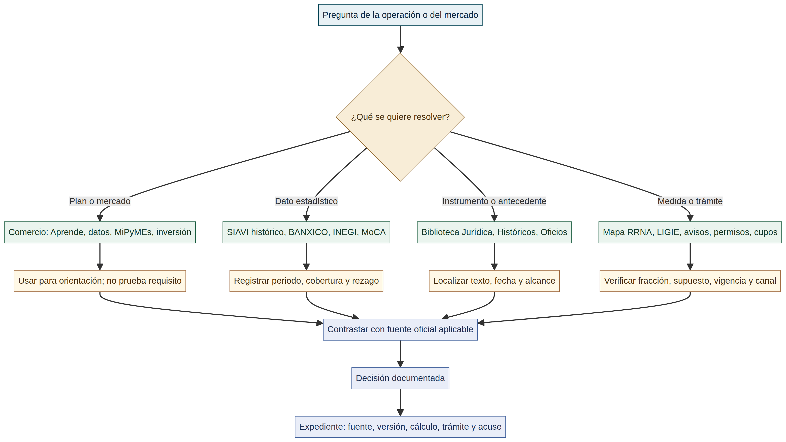

# Herramientas SNICE: consulta, normatividad y evidencia

SNICE reúne en una misma entrada recursos de orientación comercial, bases de datos, herramientas por fracción, directorios, documentos administrativos y rutas de normatividad. Esa concentración facilita comenzar una investigación, pero puede producir un error frecuente: asumir que toda pantalla, archivo, dato estadístico o aviso tiene el mismo efecto que un acuerdo, decreto, resolución o ley vigente. No lo tiene.

La forma segura de usar el portal es convertir cada consulta en una cadena verificable: **pregunta → herramienta → fuente aplicable → decisión → expediente**. La herramienta ayuda a localizar, comparar o explorar; el instrumento aplicable y sus condiciones sostienen la conclusión. La arquitectura de decisión de esta wiki explica esa diferencia desde el nivel de una operación; esta guía la aplica a las rutas visibles de Comercio, Herramientas de Comercio Exterior y Normatividad de SNICE.[1]

*Diagrama elaborado para esta wiki. Ordena usos de consulta; no atribuye vigencia, aplicabilidad ni autorización a una herramienta.*

## Cuatro tipos de recursos y cuatro resultados distintos

| Bloque del portal | Qué responde | Recursos observados | Resultado útil | Lo que no prueba |
|---|---|---|---|---|
| **Comercio** | ¿Qué mercado, producto, capacidad o ruta de aprendizaje explorar? | Aprende a Importar, Aprende a Exportar, Datos sobre Comercio Exterior, MiPyMEs, Invierte MX y Comercia MX | Hipótesis de mercado, planeación inicial, necesidades de información y enlaces empresariales | Fracción correcta, tasa vigente, autorización, cumplimiento de RRNA o despacho. |
| **Herramientas** | ¿Qué dato, antecedente o consulta estructurada puede orientar la investigación? | SIAVI, Base Única de RRNAs y As, fuentes estadísticas y MoCA Mx | Serie estadística, período, cobertura, catalogación o ruta de consulta | Que el dato estadístico o archivo determine un requisito jurídico actual. |
| **Normatividad** | ¿Dónde localizar un instrumento, antecedente, oficio o aviso administrativo? | Biblioteca Jurídica, Históricos, Resoluciones Anticipadas y Aviso de Disponibilidad | URL, categoría documental, fecha, antecedente y contexto de publicación | Que un índice, boletín, oficio o aviso reemplace el texto, vigencia y alcance del instrumento. |
| **Fuente aplicable** | ¿Qué rige esta mercancía y operación en la fecha concreta? | Ley, tratado, TIGIE, decreto, acuerdo, regla, resolución, permiso o trámite correspondiente | Decisión delimitada y sustentada | Que un recurso de las tres filas anteriores cierre por sí mismo el análisis. |

## Comercio: orientación antes de una operación

**Aprende a Importar** y **Aprende a Exportar** se presentan como recorridos de siete pasos. El primero inicia con definición del producto y remite a la Base Única de RRNAs y As, SIAVI y consulta estadística; el segundo añade recursos de potencial exportador, mercado y plataformas de comercialización.[2] [3] Son buenas puertas de entrada para ordenar una investigación, pero la descripción de un producto o una oportunidad comercial debe transformarse después en hechos técnicos: composición, función, presentación, envase, origen, régimen, fecha y condiciones de venta. Esos hechos permiten clasificar y revisar medidas; una recomendación de mercado no los sustituye.

La página de **Datos sobre Comercio Exterior** reúne rutas hacia Banco Mundial, OMC, INEGI y BANXICO, incluido el Cubo de Información de Comercio Exterior. Úsala para contextualizar mercados, tendencias, valor, volumen y agregaciones; registra el periodo, cobertura, unidad, nivel de producto y fecha de extracción antes de reutilizar un dato.[4] Una cifra de comercio no prueba una fracción, un origen preferencial, una cuota disponible ni una obligación de la mercancía.

MiPyMEs e Invierte MX son recursos empresariales y de inversión. El primero muestra capacitación, convocatorias y vínculos de desarrollo empresarial; el segundo publica información de inversión, relocalización, sectores y datos territoriales. Pueden ayudar a formular un proyecto, pero no son autoridad sobre la operación aduanera. Comercia MX aparece enlazado por SNICE; durante la revisión en Chrome su dominio devolvió `403 Forbidden`, por lo que esta guía conserva el enlace institucional pero no atribuye funcionalidades no verificadas.[5] [6]

## Herramientas: registra cobertura, fecha y rezago

**SIAVI** es la excepción más importante por temporalidad. Su propia página comunica que dejó de actualizarse a partir de febrero de 2022, con datos disponibles hasta noviembre de 2021, y orienta al usuario hacia INEGI y Banco de México para información comercial y al DOF para disposiciones arancelarias.[7] Puede ser útil para antecedentes históricos o para entender cómo se organizaba una consulta por fracción, pero no debe ser el origen de una tasa, estadística o requisito actual. Si se consulta, etiqueta explícitamente el resultado como histórico, registra el periodo y vuelve al instrumento vigente.

El enlace **Mapa de RRNAs y As** dirige a la Base Única LIGIE en formato `.xlsb`; el nombre del archivo consultado incorpora la fecha 2026-04-29.[8] Trátalo como un archivo estructurado de apoyo: conserva URL, fecha del archivo, versión, hoja/celda o criterio usado y filtro aplicado. Después contrasta la medida con el acuerdo, anexo, decreto, regla o resolución que la produzca y con la fecha de la operación. El archivo no sustituye transitorios, excepciones ni el resultado de un trámite.

**Fuentes estadísticas de Comercio Exterior** agrupa BANXICO, INEGI y fuentes internacionales como Trade Map y ComtradePlus. La página explica que el Cubo de BANXICO permite análisis mensual por país, sección, capítulo, partida, subpartida y fracción.[9] Es un recurso de análisis, no de determinación jurídica. **MoCA Mx** se especializa en comercio de productos siderúrgicos: publica categorías, productos, flujos y origen/destino, con actualización mensual y un desfase de dos meses; declara que su contenido es exclusivamente informativo y estadístico.[10] Por ello, MoCA no prueba la clasificación, el alcance de una cuota compensatoria, un aviso automático o una tasa de acero.

## Calculadoras, clasificadores y consultas operativas

La **Calculadora de Origen** de SNICE es un apoyo específico para reglas de origen del T-MEC. Su página indica que un cuestionario genera un reporte sobre origen y arancel para importaciones a Estados Unidos o Canadá; solicita datos de la mercancía —valor de transacción, costo neto, precio franco fábrica, descripción y fracción— y de los insumos, como valor, país de origen y fracción.[15] Antes de usar un reporte, confirma la fracción, la regla de origen específica, el método de cálculo aplicable, la versión del tratado y los soportes de producción/costo. Un resultado de cuestionario no sustituye certificación de origen, expediente de insumos o responsabilidad del certificador.

El **Buscador de fracciones arancelarias** de VUCEM se presenta como ruta oficial de búsqueda; durante la revisión, la página de entrada mostró “Cargando clasificador” y redirigió a una aplicación cuya extracción sólo expuso búsqueda y ayuda.[16] SNICE enlaza **Mi Fracción Arancelaria** como una aproximación basada en características de producto, pero su ruta cargó vacía en Chrome durante esta auditoría.[15] Ambos recursos son útiles para iniciar hipótesis; ninguno convierte por sí solo una coincidencia textual o una aproximación en clasificación jurídica. Para cerrar la clasificación conserva ficha técnica, fotografías cuando aporten hecho técnico, composición, uso, presentación, reglas/notas aplicables, texto vigente y razonamiento.

La ruta de **Calculadora de Aranceles o Contribuciones** de VUCEM se publicó como herramienta oficial, pero el contenido recuperado el 2026-08-16 muestra “en construcción”.[17] La wiki no presenta una fórmula ni recomienda usarla para estimar un pago actual. Para una estimación reproducible parte de fracción, régimen, valor en aduana, fecha, origen, incrementables/disminuibles, contribución, exención o programa y fuente vigente; consulta después la guía de contribuciones y el instrumento aplicable.

Las consultas de seguimiento responden preguntas distintas. **DODA** pide un número de integración y expone un estatus de pedimento.[18] La consulta rápida **SOIA/ANAM** explica que permite buscar por pedimento/aduana/año, VIN/año o contenedor/aduana/año, y devolver estatus, datos principales o último movimiento, según la entrada.[19] No introduzcas en documentos de ejemplo identificadores de terceros. En una operación propia, conserva el resultado con fecha y contexto, pero contrástalo con pedimento, acuse, documentos de transporte, evidencia de arribo o retorno y datos declarados: un estatus no reemplaza el expediente.

## Normatividad: localizar no equivale a concluir

La **Biblioteca Jurídica** organiza Tratados y Acuerdos Internacionales, Códigos y Leyes, Reglamentos, Decretos, Acuerdos, Resoluciones y Reglas.[11] Es la ruta adecuada para descubrir el tipo de instrumento, pero una conclusión exige abrir el texto, confirmar fecha de publicación y entrada en vigor, leer transitorios y ubicar el supuesto concreto. Cuando exista una versión consolidada oficial, también debe contrastarse contra eventos posteriores.

**Históricos** conserva publicaciones de Actualidad, consultas públicas, boletines y DOF vinculados con comercio exterior.[12] Su valor es temporal: permite reconstruir contexto, localizar antecedentes y detectar que una medida cambió. Una consulta pública, boletín o entrada de actualidad no demuestra por sí misma que un proyecto entró en vigor o que una obligación permanezca aplicable.

**Resoluciones Anticipadas** publica oficios de la Dirección General de Facilitación Comercial y de Comercio Exterior relacionados con regulaciones aplicables.[13] Lee el oficio completo, su fecha, tema, destinatario, producto, acto vinculado y alcance antes de utilizarlo. Un oficio puntual no se vuelve una regla general para otra persona, mercancía o periodo sólo porque trate un asunto parecido. El **Aviso de Disponibilidad** muestra archivos administrativos emitidos por la misma Dirección y su fecha de actualización; sirve para vigilar disponibilidad, no para acreditar una autorización, vigencia normativa o cumplimiento.[14]

## Método de consulta que deja evidencia útil

Cuando uses un recurso SNICE, conserva una ficha breve. Debe responder qué pregunta originó la consulta, qué URL y fecha se usaron, qué filtro o fracción se introdujo, qué resultado apareció, qué fuente aplicable se contrastó y qué documento soporta la decisión. Si hubo una solicitud, aviso, permiso, certificado o transmisión, agrega folio, vigencia, dato declarado y acuse. Si el resultado fue que una medida no aplica, conserva también instrumento, supuesto y razonamiento de exclusión.

| Pregunta | Recurso inicial posible | Contraste indispensable | Evidencia mínima |
|---|---|---|---|
| ¿Qué mercado o producto explorar? | Aprende, datos, MiPyMEs o Invierte MX | Datos con periodo/cobertura y estrategia propia | Fuente, extracción, producto/mercado y fecha. |
| ¿Qué comportamiento tiene una fracción? | BANXICO, INEGI, MoCA o SIAVI histórico | Periodo, metodología, rezago y instrumento vigente separado | Consulta, período, filtros y fuente estadística. |
| ¿Qué instrumento o antecedente buscar? | Biblioteca Jurídica, Históricos u oficio | Texto oficial, fecha efectiva, transitorios y alcance | URL, versión, publicación y pasaje/supuesto usado. |
| ¿Qué requisito debe cumplir una operación? | Base Única, Mapa RRNA, LIGIE o micrositio de medida | Acuerdo, anexo, resolución, trámite, régimen y fecha | Fracción, instrumento, documento, folio/acuse y pedimento. |
| ¿Puede obtenerse una preferencia T-MEC? | Calculadora de Origen SNICE | Regla específica, clasificación, método, versión del tratado e insumos | Reporte, BOM/costos, regla usada y soporte de origen. |
| ¿Qué fracción es una hipótesis inicial? | Clasificador VUCEM o Mi Fracción Arancelaria | Ficha técnica, reglas/notas, texto vigente y razonamiento | Consulta fechada y expediente de clasificación. |
| ¿Qué revela una consulta de seguimiento? | DODA o SOIA/ANAM | Pedimento, acuse, transporte/arribo y datos declarados | Captura o resultado fechado, identificador propio y expediente relacionado. |

## Fuentes oficiales y de referencia

[1] [SNICE, portal principal](https://www.snice.gob.mx/cs/avi/snice/home.html), estructura de bloques Comercio, Herramientas, Normatividad y Medidas no Arancelarias observada en la consulta de 2026-08-16.

[2] [SNICE, *Aprende a Importar*](https://www.snice.gob.mx/cs/avi/snice/comercio.aprende.importar.html), guía orientativa de siete pasos y enlaces de consulta.

[3] [SNICE, *Aprende a Exportar*](https://www.snice.gob.mx/cs/avi/snice/comercio.aprende.exportar.html), guía orientativa de siete pasos y recursos de exportación.

[4] [SNICE, *Datos sobre Comercio Exterior*](https://www.snice.gob.mx/cs/avi/snice/comerciointernacional.html), directorio institucional de indicadores y fuentes de datos.

[5] [MiPyMEs](https://mipymes.economia.gob.mx/) y [Invierte MX](https://www.economia.gob.mx/inviertemx/), recursos institucionales de desarrollo empresarial e inversión; no sustituyen fuentes de cumplimiento.

[6] [Comercia MX](https://comerciamx.economia.gob.mx/), enlace institucional observado; acceso no verificable por respuesta 403 en Chrome el 2026-08-16.

[7] [SNICE, *SIAVI*](https://www.snice.gob.mx/cs/avi/snice/hce.siavi.html), aviso de no actualización desde febrero de 2022 y datos hasta noviembre de 2021.

[8] [SNICE, Base Única LIGIE / Mapa de RRNAs y As](https://www.snice.gob.mx/~oracle/SNICE_DOCS/BASEUNICA-LIGIE_20260429-20260429.xlsb), archivo de consulta estructurada; verificar versión e instrumento aplicable.

[9] [SNICE, *Fuentes estadísticas de Comercio Exterior*](https://www.snice.gob.mx/cs/avi/snice/fuentesestadisticas.html), directorio de fuentes estadísticas y descripción del Cubo BANXICO.

[10] [SNICE, *MoCA Mx*](https://www.snice.gob.mx/cs/avi/snice/mca.html), Monitor de Comercio de Acero en México, datos con desfase y uso exclusivamente informativo/estadístico.

[11] [SNICE, *Biblioteca Jurídica*](https://www.snice.gob.mx/cs/avi/snice/biblioteca.juridica.html), índice de categorías documentales para localización.

[12] [SNICE, *Históricos*](https://www.snice.gob.mx/cs/avi/snice/historicos.html), archivo de Actualidad, consultas públicas, boletines y DOF.

[13] [SNICE, *Resoluciones Anticipadas*](https://www.snice.gob.mx/cs/avi/snice/normatividad.res.anticip.html), publicaciones de oficios de la DGFCCE.

[14] [SNICE, *Aviso de Disponibilidad*](https://www.snice.gob.mx/cs/avi/snice/aviso.disponibilidad.html), archivo administrativo con fecha de actualización.

[15] [SNICE, *Calculadora de Origen*](https://www.snice.gob.mx/cs/avi/snice/hce.calc.origen2020.html), cuestionario y reportes orientativos de reglas de origen T-MEC; revisar manual, glosario y regla específica.

[16] [VUCEM, *Buscador de fracciones arancelarias*](https://www.ventanillaunica.gob.mx/vucem/Clasificador.html), ruta oficial de acceso al clasificador; disponibilidad dinámica observada el 2026-08-16.

[17] [VUCEM, *Calculadora de Aranceles*](https://www.ventanillaunica.gob.mx/vucem/calculadora.html), contenido publicado como “en construcción” al 2026-08-16.

[18] [VUCEM, *Estatus de pedimentos DODA*](https://www.ventanillaunica.gob.mx/vucem/doda.html), consulta por número de integración; no sustituye el expediente documental.

[19] [ANAM, *Consulta Rápida de Pedimentos de Vehículos y Contenedores*](https://www.anam.gob.mx/consulta-rapida-de-pedimentos-de-vehiculos-y-contenedores/), descripción oficial de consultas SOIA por pedimento, VIN o contenedor.

El [catálogo reproducible de fuentes](../../catalog/registry.md) conserva identificadores y estado de procedencia a nivel de repositorio.

## Ver también

[Arquitectura de decisión y evidencia](arquitectura-decision-evidencia.md) · [Biblioteca de instrumentos prioritarios](biblioteca-instrumentos-prioritarios.md) · [TIGIE y NICO](../clasificacion/tigie-nico.md) · [Medidas arancelarias, RRNA y evidencia](../rrna/mapa-medidas-arancelarias-rrna.md) · [Trazabilidad de evidencia](../operacion/trazabilidad-evidencia.md)

> **Límite de uso:** una herramienta puede revelar un dato, un antecedente o una URL. La conclusión sobre clasificación, tasa, medida, permiso, vigencia o cumplimiento debe quedar vinculada al instrumento y a los hechos concretos de la operación.
