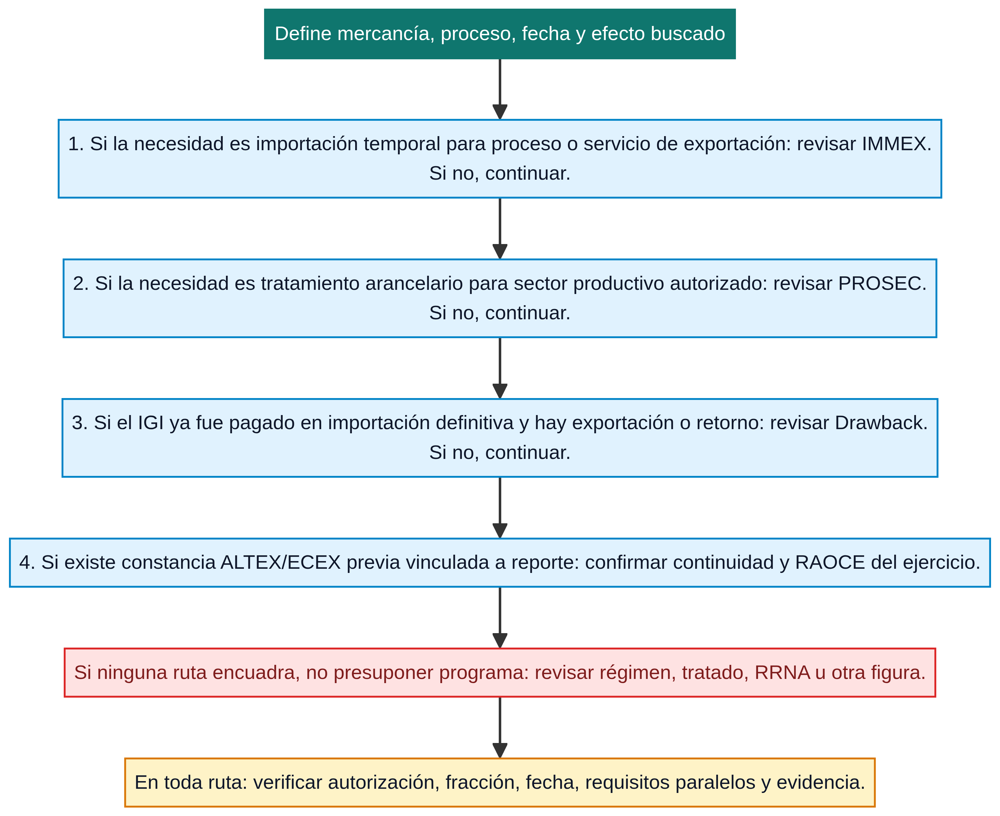

# Programas de fomento y RAOCE

Los **programas de fomento** no son una sola tasa, permiso ni clasificación. Son instrumentos distintos que pueden afectar una operación de maneras diferentes: importación temporal para procesos de exportación, tasa sectorial para ciertos insumos o devolución posterior de IGI pagado. La primera tarea es identificar **qué mecanismo se busca**, quién puede ser titular, qué autorización o supuesto lo sostiene y qué obligación posterior conserva su efecto.

La evidencia institucional localizada en SNICE mantiene micrositios de **IMMEX**, **PROSEC** y **Drawback**. Para 2026, la guía de Reporte Anual de Operaciones de Comercio Exterior (RAOCE) trata también casos de **ALTEX y ECEX** vinculados a continuidad/transitorios.[1] [2] Esta página distingue esas situaciones para evitar afirmar que una constancia histórica, un trámite anual o un programa vigente son equivalentes.

> Un programa no sustituye la fracción, el régimen, el origen, la RRNA, el valor ni el pedimento. Puede añadir condiciones o un tratamiento al supuesto correcto, pero cada elemento debe seguir comprobándose con su propia fuente y evidencia.

*Diagrama de lectura elaborado para esta wiki. Organiza preguntas de descarte y rutas de consulta; no determina elegibilidad ni sustituye autorización, decreto, fracción, vigencia o revisión de una operación concreta.*

## Mapa de instrumentos y estado de lectura

| Instrumento o caso | Qué pregunta ayuda a resolver | Evidencia mínima para empezar el análisis | Límite que no debe olvidarse |
|---|---|---|---|
| [IMMEX](immex.md) | ¿La empresa autorizada puede usar importación temporal vinculada a elaboración, transformación, reparación o servicios de exportación? | Programa/modalidad autorizados, mercancía, régimen temporal, controles y destino posterior | No toda operación de una empresa IMMEX tiene el mismo plazo, control fiscal o condición de retorno. |
| [PROSEC](prosec.md) | ¿Existe un tratamiento arancelario sectorial aplicable a insumos o maquinaria bajo programa autorizado? | Programa y sector, fracción, bien producido, tasa vigente y datos de la operación | No es una preferencia de tratado ni prueba origen; tampoco convierte cualquier fracción en elegible. |
| [Drawback](drawback.md) | ¿Puede solicitarse devolución de IGI pagado después de una importación definitiva y exportación o retorno que encuadre en el esquema? | Importación definitiva, pago de IGI, vínculo con exportación/retorno, plazo y expediente | No es exención automática en el pedimento ni sinónimo de importación temporal IMMEX. |
| ALTEX y ECEX: continuidad RAOCE | ¿La empresa mantiene una constancia o modalidad histórica vinculada al reporte anual? | RFC, constancia/resolución, programa relacionado, ejercicio y estado mostrado en VUCEM | La guía RAOCE 2026 no debe leerse como apertura de nuevas autorizaciones ni como calendario permanente. |

Los tres primeros son instrumentos ya modelados en el catálogo de la wiki. ALTEX y ECEX se muestran como **casos de continuidad** porque las fuentes revisadas los relacionan con el Cuarto Transitorio del Decreto IMMEX y con un reporte anual; no existe todavía en el repositorio una fuente primaria suficiente para modelarlos como nuevos programas disponibles en general.[2]

## Cómo elegir la ruta correcta sin confundir beneficios

La decisión empieza por el hecho económico y operativo, no por el nombre del programa. Si la operación requiere introducir temporalmente bienes para un proceso de exportación, la ruta de análisis comienza en IMMEX y la importación temporal. Si se busca una tasa de IGI asociada a producción sectorial, debe revisarse PROSEC, sector, fracción y bien producido. Si el IGI ya fue pagado en importación definitiva y el caso encuadra en exportación o retorno, la pregunta se desplaza a Drawback.

Estas rutas no se sustituyen entre sí. La secuencia útil es: describir mercancía y proceso; clasificar; localizar régimen y fechas; revisar el instrumento de fomento; confirmar autorización/titularidad; identificar obligaciones posteriores; y conservar documentos, acuses y datos que vinculen el programa con la operación. La [Arquitectura de decisión y evidencia](../fundamentos/arquitectura-decision-evidencia.md) explica por qué esa evidencia debe mantenerse separada de la interfaz o de un único resultado de sistema.

## RAOCE: obligación anual, no beneficio automático

La guía VUCEM RAOCE 2026 describe un reporte anual para empresas con programas o constancias relacionados. Sus fechas pertenecen al ciclo informado y se presentan aquí únicamente como ejemplo de cómo una obligación anual puede variar por instrumento. Antes de actuar, consulta el ejercicio, la guía vigente, el programa relacionado y el estado de la empresa en VUCEM.[2]

| Modalidad mostrada en la guía RAOCE 2026 | Periodo o condición expuesta por la guía | Qué conservar | Advertencia temporal |
|---|---|---|---|
| IMMEX | Presentación desde el 1 de abril de 2026 hasta el último día hábil de mayo; la guía señala reglas posteriores de suspensión y cancelación para ese ciclo. | Acuse, folio, cifras declaradas, fuente de ventas/exportaciones y relación con programa autorizado. | La propia guía indica que programas autorizados en 2026 no presentan ese RAOCE; no reutilices esta regla fuera del ciclo sin confirmarla. |
| PROSEC | Presentación desde el 1 de abril de 2026 hasta el último día hábil de abril; la guía prevé excepción de mayo para empresas que también cuenten con IMMEX, ALTEX o ECEX. | Acuse, datos de ventas/importaciones/exportaciones y relación de bienes producidos cuando corresponda. | La fecha y excepción dependen del ciclo 2026 y de los programas vinculados. |
| ALTEX y ECEX | La sección ALTEX/ECEX de la guía muestra un periodo de presentación de 2025 y una consecuencia en mayo de 2026. | Constancia o resolución, RFC, reporte/acuse, estado en VUCEM y fundamento de continuidad. | Es información históricamente acotada; no demuestra disponibilidad de una autorización nueva en agosto de 2026. |

La guía indica que VUCEM genera acuse y folio para los programas seleccionados, y que la operación de reporte se relaciona con el RFC y los programas mostrados por el sistema. Ese resultado debe enlazarse al expediente de la empresa y al ciclo aplicable; un acuse no reemplaza la autorización, ni una autorización elimina la necesidad de conservar el reporte cuando corresponda.[2]

## Directorios, micrositios y fuentes de decisión

SNICE publica directorios de beneficiarios y plantas para IMMEX y PROSEC y señala una actualización mensual. Son útiles para transparencia y verificación contextual, pero un directorio no determina por sí solo que una mercancía, planta u operación específica cumpla el programa. La autorización, el régimen, la fracción, las condiciones del decreto, la fecha y los documentos de operación siguen siendo necesarios.[1]

Los micrositios oficiales separan **Acerca de**, **Normatividad**, **Trámites** y, según el programa, guías o formatos. Esa estructura ofrece una ruta de consulta reproducible:

| Pregunta | Recurso inicial | Confirmación necesaria |
|---|---|---|
| ¿Qué persigue el programa? | Sección “Acerca de” de SNICE | Decreto, alcance y supuesto concreto. |
| ¿Qué norma lo rige? | Sección “Normatividad” y publicación jurídica vinculada | Texto, reformas, transitorios y fecha efectiva. |
| ¿Cómo se presenta un trámite o reporte? | Sección “Trámites” o guía VUCEM | Homoclave, ejercicio, titular, estado y acuse. |
| ¿Quién aparece como beneficiario? | Directorios de transparencia IMMEX/PROSEC | Autorización, planta, periodo y relación con la operación. |

## Checklist de control por operación

Antes de declarar que un beneficio o programa aplica, deja una respuesta documentada para cada punto: identidad de la empresa y autorización; mercancía, clasificación y NICO; régimen y fecha de operación; regla/decreto y versión; requisito de origen, producción, retorno o exportación; RRNA y restricciones separadas; cálculo de contribuciones; pedimento/documentos electrónicos; y, si corresponde, reporte anual, folio y estado del programa.

Si cambian mercancía, proceso, planta, proveedor, origen, fracción, régimen, fecha o programa asociado, vuelve a revisar el supuesto. La [Reconciliación y control de cambios](../operacion/reconciliacion-control-cambios.md) ayuda a registrar cuándo una diferencia es meramente documental y cuándo exige repetir análisis de fondo.

## Fuentes oficiales y de referencia

[1] [SNICE, *Programas de Fomento: Información de Beneficiarios*](https://www.snice.gob.mx/cs/avi/snice/transparencia.programasfomento.html), directorios y vínculos a micrositios de IMMEX y PROSEC; verificar fecha de actualización del directorio consultado.

[2] [SNICE, *Guía VUCEM RAOCE 2026 para Programas de Fomento*](https://www.snice.gob.mx/~oracle/SNICE_DOCS/RAOCE-2026-PROGRAMAS-DE-FOMENTO_20260423-20260423.pdf), guía operativa con fechas y modalidades de su ciclo; no usar como calendario permanente.

[3] [SNICE, *IMMEX*](https://www.snice.gob.mx/cs/avi/snice/programasdefom.immex.html) · [*PROSEC*](https://www.snice.gob.mx/cs/avi/snice/programasdefom.prosec.html) · [*Drawback*](https://www.snice.gob.mx/cs/avi/snice/programasdefom.drawback.html), micrositios administrativos de consulta y acceso a normatividad/trámites.

Catálogo local de instrumentos y fuentes: `docs/catalog/mexico/arancel.md` y `docs/catalog/registry.md`.

## Ver también

[IMMEX](immex.md) · [PROSEC](prosec.md) · [Drawback](drawback.md) · [TIGIE y NICO](../clasificacion/tigie-nico.md) · [Lectura de tarifa y tratamientos](../contribuciones/lectura-tarifa-y-tratos.md) · [Pedimento y RGCE](../aduana/pedimento-rgce.md)

> **Límite de uso:** este mapa organiza rutas de consulta y control. **No es asesoría legal.** Confirma autorización, vigencia, programa asociado, fechas, requisitos y estado de la empresa en las fuentes oficiales antes de utilizar un tratamiento o presentar un reporte.
