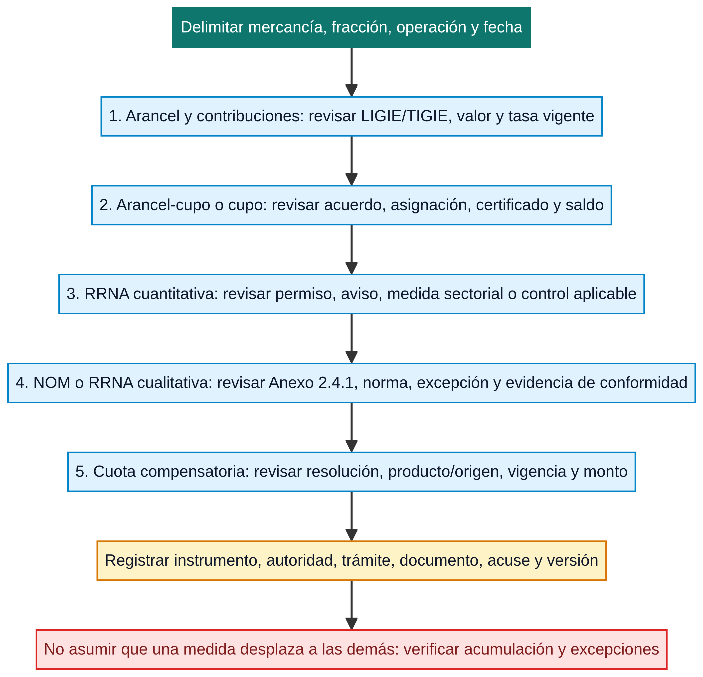

# Medidas arancelarias, RRNA y evidencia

Una operación de comercio exterior puede quedar sujeta a **varias medidas a la vez**. El arancel responde a una pregunta de contribución; una cuota compensatoria responde a una resolución específica; un cupo conecta una cantidad con un trato determinado; un permiso o aviso controla un supuesto sectorial; una NOM puede exigir cumplimiento o evidencia relacionada con el producto. Ninguna de esas capas sustituye automáticamente a otra.

La clave de lectura es mantener una cadena explícita: **mercancía → fracción/NICO → fecha y régimen → instrumento → autoridad → trámite o documento → pedimento/evento → expediente**. SNICE describe los aranceles como ad valorem, específicos o mixtos, y distingue modalidades como arancel-cupo y estacional; también separa regulaciones no arancelarias cuantitativas y cualitativas.[1] Esta guía organiza esa distinción para que la búsqueda en herramientas oficiales no se convierta en una conclusión prematura.

> Una fracción arancelaria inicia la búsqueda, pero no prueba por sí sola la tasa, el permiso, la excepción, el cupo disponible, la norma aplicable ni la procedencia de una operación. Cada conclusión debe conservar su fuente y fecha.

*Diagrama de lectura elaborado para esta wiki. Ordena capas de consulta; no afirma que todas las medidas aplican ni que la secuencia sustituya el instrumento, trámite, resolución o análisis de una operación concreta.*

## No son sinónimos: matriz de medidas

| Capa | Pregunta que resuelve | Fuente inicial | Evidencia que suele requerir | Error que evita |
|---|---|---|---|---|
| Arancel e IGI | ¿Qué tipo de arancel y tasa corresponden a la mercancía en la fecha relevante? | LIGIE/TIGIE, decreto o medida temporal y [Lectura de tarifa](../contribuciones/lectura-tarifa-y-tratos.md) | Fracción, NICO, fecha, valor y cálculo | Confundir el texto de una partida o una herramienta con la tasa efectiva de una operación. |
| Contribuciones de importación | ¿Qué conceptos se calculan además del IGI y con qué base? | [Impuestos de importación](../contribuciones/impuestos-importacion.md), valor y régimen | Valor, base, tasa, pedimento y comprobantes aplicables | Tratar el arancel como el único concepto de la operación. |
| Arancel-cupo y cupo | ¿Existe una cantidad con tasa distinta o un límite/beneficio sujeto a certificado? | Acuerdo específico, Ley de Comercio Exterior y micrositio de cupos SNICE | Asignación, certificado, vigencia, saldo y pedimento | Aplicar la tasa dentro de cupo sin asignación/certificado o después de su vigencia. |
| Cuota compensatoria | ¿Una resolución por producto/origen agrega una medida distinta a la tarifa? | Resolución aplicable y consulta de cuotas | Producto, origen, fracción, resolución, vigencia y cálculo | Integrarla en la LIGIE o asumir que un TLC la elimina. |
| RRNA cuantitativa | ¿La operación exige permiso previo, aviso automático, cupo u otro control de flujo? | Acuerdo, reglas, micrositio sectorial y autoridad competente | Autorización/aviso, datos de mercancía, vigencia, acuse y anexos | Suponer que todo aviso es un permiso o que un ejemplo sectorial aplica a otra fracción. |
| RRNA cualitativa y NOM | ¿El producto, etiquetado, envase, seguridad u otra condición exige cumplimiento o evidencia? | Anexo 2.4.1, NOM específica, reglas, autoridad y [guía NOM](anexo-2-4-1.md) | Fracción, supuesto, excepción, documento de conformidad y evidencia del producto | Confundir estar listado con el modo, momento o excepción de cumplimiento. |

## La secuencia correcta: primero hechos, después tratamiento

El análisis empieza con una descripción técnica de la mercancía, su composición, función, presentación, envase, proceso, país de origen, destino, régimen y fecha de operación. Esos hechos sostienen la clasificación y permiten buscar medidas asociadas. Si falta la fecha, se corre el riesgo de usar un decreto, anexo, acuerdo o resolución que ya fue modificado; si falta el régimen, se puede confundir un requisito de importación definitiva con un supuesto temporal o de exportación.

Después se separan las preguntas. Para arancel y contribuciones, se revisan fracción, NICO, valor, tasa, trato preferencial o programa y fecha. Para medidas no arancelarias, se verifica si el producto y su fracción aparecen en el instrumento correspondiente y, de ser así, qué autoridad, trámite, documento, vigencia, excepción o evidencia exige. Para una cuota compensatoria se requieren además producto, origen y resolución. El [Ciclo de vida de una RRNA](ciclo-de-vida-rrna.md) profundiza en la relación entre medida, autoridad, trámite y control posterior.

La última etapa no es “guardar una pantalla”. El expediente debe conectar la fuente consultada y su versión con la decisión, el documento comercial, el permiso/aviso/certificado si corresponde, el pedimento o transmisión y los acuses generados. La [Trazabilidad de evidencia](../operacion/trazabilidad-evidencia.md) explica cómo conservar esos vínculos sin deducir cumplimiento desde un solo folio.

## Arancel, arancel-cupo y cupo: tres preguntas distintas

Un arancel es un impuesto aplicable a la entrada o salida de mercancías. SNICE enumera formas ad valorem, específicas y mixtas, y describe el **arancel-cupo** como una modalidad con una tasa para cierta cantidad o valor y otra para lo que excede ese monto.[1] Esa definición no significa que cada mercancía con tasa diferenciada tenga acceso automático: hay que localizar el acuerdo, la fracción, el periodo, la cantidad, las condiciones y, cuando corresponda, la asignación o el certificado.

El micrositio de cupos de SNICE explica que un cupo puede ser máximo o puede funcionar dentro de un arancel-cupo, y que la autorización se otorga mediante certificado con vigencia propia. También distingue asignación directa, licitación pública y primero en tiempo, primero en derecho, además de modalidades mixtas.[2] Por ello, una revisión robusta debe conservar cuatro referencias separadas: acuerdo que crea/regula el cupo, mecanismo de asignación, certificado/saldo del beneficiario y declaración de la operación. Un certificado vencido o ajeno a la operación no se vuelve válido porque la fracción siga apareciendo en una herramienta.

## Permisos, avisos y controles sectoriales

Los micrositios de SNICE agrupan **avisos automáticos**, **permisos previos** y **permisos automáticos**, pero esas etiquetas no sustituyen el instrumento que gobierna una medida concreta. Los ejemplos publicados —como tomate, siderúrgicos, aluminio, control de exportaciones, azúcar, calzado o textiles— muestran que cambian fracciones, operación, documentos y canal de presentación.[3]

Antes de solicitar o declarar uno, identifica la publicación que origina el requisito, las fracciones y operaciones cubiertas, la autoridad, el tipo de trámite, el documento de soporte, la fecha de vigencia y el evento que se acredita. Si la plataforma asigna una clave o genera un acuse, vincúlalo con factura, ficha técnica, fracción, permiso/aviso y pedimento; no lo presentes como sustituto de la regla que establece el requisito.

## NOM y Anexo 2.4.1: listado, supuesto y evidencia

El micrositio de NOM de SNICE sitúa esta materia en el Capítulo 2.4 de las Reglas y criterios de la Secretaría de Economía y explica que el **Anexo 2.4.1** identifica fracciones sujetas al cumplimiento de NOM en el punto de entrada al país y de salida.[4] El Anexo sirve para ubicar la relación entre fracción y medida; la determinación completa exige leer la regla, el numeral, la NOM específica, el supuesto de producto, el momento de cumplimiento y cualquier excepción aplicable.

La nota institucional sobre mensajería y paquetería con valor equivalente y/o no mayor a USD 2,500 se refiere específicamente a exenciones de los numerales 1, 3 y 5 del Anexo 2.4.1. No debe extrapolarse a todo régimen, producto, valor, operador o numeral: antes de invocarla, confirma el texto vigente, los hechos del envío y el alcance exacto de la regla.[4]

Una evidencia útil para esta capa no es uniforme. Según el supuesto puede requerirse documento de conformidad, etiquetado, información técnica, certificado, excepción, acuse o documento transmitido. La [guía de Anexo 2.4.1 y NOM](anexo-2-4-1.md) transforma esa búsqueda en una lista de control y aclara por qué una NOM de producto no se presume sólo por conocer la fracción.

## Medidas acumuladas y límites de las herramientas

Es posible que en una misma operación coincidan arancel, IVA u otra contribución, una RRNA, un requisito de NOM, un cupo o una cuota compensatoria. También es posible que alguna no aplique por el régimen, la fecha, el origen, una excepción o el supuesto material. La decisión no debe construirse sumando nombres de medidas ni descartándolas por intuición: cada una exige su instrumento y su evidencia.

Las herramientas de SNICE —incluida Mi Fracción Arancelaria y la Biblioteca Jurídica— son rutas institucionales útiles para localizar información.[1] Úsalas para abrir la investigación, conservar la URL y localizar documentos; después verifica instrumento, texto, fecha efectiva, autoridad, trámite y resultado propio de la operación. La interfaz no reemplaza una publicación ni actualiza por sí sola el expediente histórico.

## Checklist mínimo antes de declarar o concluir

| Antes de afirmar… | Deja identificada… | Vincula en el expediente… |
|---|---|---|
| Una tasa arancelaria | Fracción, NICO, fecha, tipo de arancel, valor y fuente | Cálculo, versión de instrumento y datos del pedimento. |
| Un cupo o arancel-cupo | Acuerdo, cantidad, mecanismo, certificado y vigencia | Asignación, certificado, saldo y operación declarada. |
| Una RRNA cuantitativa | Medida, autoridad, trámite, fracción y supuesto | Solicitud, permiso/aviso, acuse y documentos de soporte. |
| Una NOM o RRNA cualitativa | Regla/numeral, NOM, producto, excepción y momento | Documento de conformidad, etiqueta/soporte técnico y evidencia requerida. |
| Una cuota compensatoria | Resolución, producto, origen, fecha, monto y alcance | Resolución aplicable, cálculo y elementos de producto/origen. |

## Fuentes oficiales y de referencia

[1] [SNICE, *Documentos que avalen el cumplimiento de RRNA*](https://www.snice.gob.mx/cs/avi/snice/comercio.aprende.exportar.rrnas.html), explicación institucional de aranceles, modalidades y distinción entre RRNA cuantitativas/cualitativas.

[2] [SNICE, *Cupos: Acerca de*](https://www.snice.gob.mx/cs/avi/snice/drrnas.cupos.acercade.html), información administrativa sobre cupos, certificado, vigencia y mecanismos de asignación; verificar el acuerdo específico aplicable.

[3] [SNICE, *Avisos y Permisos: Trámites*](https://www.snice.gob.mx/cs/avi/snice/drrnas.avisosypermisos.tramites.html), rutas operativas y ejemplos sectoriales; no usar un ejemplo fuera de su instrumento, fracción y vigencia.

[4] [SNICE, *NOM's: Normatividad*](https://www.snice.gob.mx/cs/avi/snice/seguridad.normatividad.html), ruta institucional al Capítulo 2.4 y Anexo 2.4.1; contrastar siempre la regla, el numeral y la NOM vigente.

[5] [Ley de Comercio Exterior](https://www.diputados.gob.mx/LeyesBiblio/pdf/LCE.pdf) · [LIGIE vigente](https://www.diputados.gob.mx/LeyesBiblio/pdf/LIGIE_2022.pdf) · [Reglas y criterios SE](https://sidof.segob.gob.mx/notas/5651333), textos de referencia que deben revisarse junto con sus reformas y fechas efectivas.

## Ver también

[Lectura de tarifa y tratamientos](../contribuciones/lectura-tarifa-y-tratos.md) · [Impuestos de importación](../contribuciones/impuestos-importacion.md) · [Cuotas compensatorias](../contribuciones/cuotas-compensatorias.md) · [Guía de RRNA](index.md) · [Ciclo de vida de una RRNA](ciclo-de-vida-rrna.md) · [TIGIE y NICO](../clasificacion/tigie-nico.md)

> **Límite de uso:** esta guía estructura el análisis y no constituye una determinación jurídica, fiscal, técnica o de cumplimiento. Antes de operar, confirma instrumento, versión, fecha, fracción, supuesto, autorización, excepción, documento y resultado aplicable a la operación concreta.
